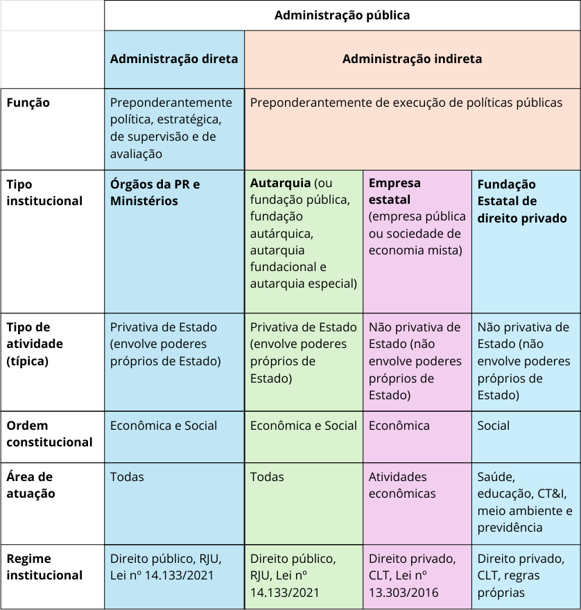
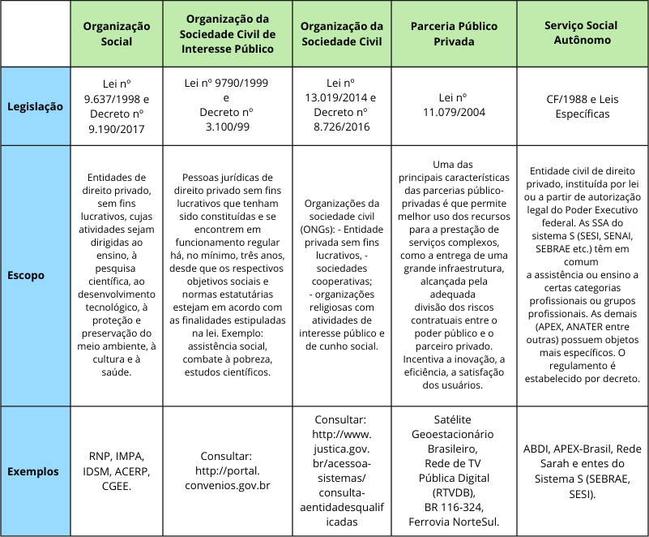

Organização da Administração Pública Federal
============================================
 
.. admonition:: Sobre este capítulo
 
   Neste capítulo, você compreenderá como a Administração Pública Federal se organiza
   para implementar políticas públicas. Você verá desde o desenho de suas estruturas
   próprias até as estratégias de articulação com a sociedade civil, por meio de
   parcerias, para a entrega de serviços de qualidade aos cidadãos.
 
 
O Estado é a organização jurídico-política cuja estrutura, funções e limites são
disciplinados pela Constituição e pela legislação infraconstitucional. O Estado
brasileiro é uma república democrática com organização federativa, integrado pelos
Poderes Legislativo, Executivo e Judiciário, compreendendo a União, os Estados,
o Distrito Federal e os Municípios.
 
Na qualidade de Estado Democrático de Direito, a Constituição assegura a igualdade
política, o acesso à informação e o direito à participação e ao controle dos cidadãos
nos processos de formulação, implementação e avaliação de políticas públicas.
 
A Administração Pública é regulada pelo art. 37 da `Constituição Federal <cf-1988_>`_.
Do ponto de vista jurídico, a doutrina a define sob dois aspectos principais
:cite:`di_pietro_2023`:
 
* **Sentido material ou objetivo:** a atividade concreta e imediata que o Estado
  desenvolve, sob regime jurídico total ou parcialmente público, para a consecução
  dos interesses coletivos.
 
* **Sentido subjetivo ou formal:** o conjunto de órgãos e de pessoas jurídicas aos
  quais a lei atribui o exercício da função administrativa do Estado.
 
O conjunto de órgãos e entidades que integram a administração pública é dinâmico,
adaptando-se às necessidades de implementação e às linhas programáticas do governo
eleito.
 
O art. 84, VI, "a", da `Constituição Federal <cf-1988_>`_, com redação dada pela
Emenda Constitucional nº 32, de 11 de setembro de 2001, estabelece a competência
privativa do Presidente da República para dispor, mediante decreto, sobre a
organização e o funcionamento da administração federal, desde que não implique
aumento de despesa nem a criação ou extinção de órgãos públicos. Diante das
transformações políticas e tecnológicas, essas estruturas são constantemente
aperfeiçoadas para garantir a eficiência da ação estatal.
 
O `Decreto-Lei nº 200, de 25 de fevereiro de 1967 <dl-200_>`_, parcialmente
vigente, classifica os órgãos e as entidades da administração federal em dois grandes
blocos: a **administração direta** e a **administração indireta**.
 
 
Administração direta
---------------------
 
Na organização da administração pública federal direta, a Presidência da República
atua como órgão independente do Poder Executivo da União, responsável pelas atividades
de política, planejamento, coordenação e controle do desenvolvimento socioeconômico do
País e da segurança nacional :cite:`di_pietro_2023`. Nesse sentido, a administração
direta exerce uma função predominantemente estratégica, focada na formulação,
supervisão e avaliação de políticas públicas.
 
Os ministérios são órgãos autônomos situados logo abaixo da Presidência da República.
Integram a Administração Direta e supervisionam as entidades da administração indireta
cujas atividades se enquadrem nas suas respectivas áreas de competência — salvo as
exceções vinculadas diretamente à Presidência :cite:`carvalho_filho_2023`.
 
A organização básica dos órgãos da Presidência da República e dos ministérios é
estabelecida em lei específica, atualmente a
`Lei nº 14.600, de 19 de junho de 2023 <lei-14600_>`_. Essa legislação define as
macrocompetências de cada ministério, as quais são posteriormente detalhadas nos
respectivos decretos de estrutura regimental ou estatuto. Assim, enquanto a lei traz
a organização básica geral, os decretos especificam o funcionamento de cada órgão,
detalhando o quadro de cargos e funções.
 
 
Administração indireta
-----------------------
 
A administração indireta tem como função principal a execução de políticas públicas e
é integrada por entidades dotadas de personalidade jurídica própria, autonomia
administrativa e funcional, vinculadas às finalidades definidas em suas leis de criação.
 
A administração indireta compreende:
 
* **Entidades de direito público:** autarquias e fundações públicas de direito público.
 
* **Entidades de direito privado:** empresas estatais (empresas públicas e sociedades
  de economia mista) e fundações instituídas pelo poder público com personalidade
  jurídica de direito privado.
 
A vinculação dessas entidades aos órgãos da administração direta é estabelecida por
ato do Poder Executivo federal, atualmente disposta no
`Decreto nº 11.401, 23 de janeiro de 2023 <decreto-11401_>`_.
 
.. note::
   Caso a proposta de alteração da estrutura regimental de um ministério inclua ou
   remova a vinculação de uma entidade, o respectivo decreto de estrutura deverá
   prever a devida alteração ou revogação no decreto de vinculação vigente.
 
.. admonition:: Importante
 
   A descentralização de atividades pode ocorrer em dois planos distintos:
 
   * **Dentro da administração pública** — por meio de entidades com personalidade
     jurídica própria, como autarquias, fundações públicas ou empresas estatais.
   * **Fora da administração pública** — por meio de parcerias com a sociedade
     civil, como organizações sociais e OSCIPs.
 
A opção pela descentralização costuma basear-se nos seguintes objetivos estratégicos
de gestão:
 
* **Especialização:** permite que estruturas focadas lidem com setores técnicos
  complexos com maior expertise do que o governo central.
 
* **Aproximação territorial:** situa a prestação dos serviços públicos próxima às
  realidades locais, melhorando a responsividade regional.
 
* **Flexibilidade administrativa:** a autonomia financeira e administrativa confere
  agilidade na tomada de decisões e na adaptação a cenários dinâmicos.
 
* **Redução da burocracia:** simplifica o fluxo decisório ao evitar que demandas
  operacionais sobrecarreguem o núcleo central do governo.
 
* **Responsabilização:** estruturas de governança próprias, como diretorias
  colegiadas, aumentam a transparência e aproximam o órgão do controle social.
 
* **Captação de recursos:** confere a capacidade de gerar receitas próprias por meio
  de taxas e tarifas — embora, na esfera federal, esse impacto seja mitigado pela
  centralização da arrecadação da União.
 
 
Autarquias e fundações públicas
~~~~~~~~~~~~~~~~~~~~~~~~~~~~~~~~
 
Autarquias e fundações públicas de direito público são pessoas jurídicas de direito
público, criadas por lei específica, para prestar serviços públicos ou executar
atividades administrativas que exijam poderes próprios de Estado. O
`Decreto-Lei nº 200, de 25 de fevereiro de 1967 <dl-200_>`_ define autarquia como
serviço autônomo, dotado de personalidade jurídica, patrimônio e receita próprios,
criado para executar atividades típicas da Administração Pública que requeiram gestão
administrativa e financeira descentralizada. A fundação pública de direito público,
criada igualmente por lei específica, sujeita-se ao mesmo regime jurídico das
autarquias, conforme jurisprudência consolidada do Supremo Tribunal Federal
:cite:`di_pietro_2023`.
 
 
Autarquias de regime especial
~~~~~~~~~~~~~~~~~~~~~~~~~~~~~~
 
As autarquias de regime especial são aquelas às quais a Constituição ou a lei outorgou
maior grau de autonomia. Suas prerrogativas típicas incluem a garantia de mandato fixo
e estabilidade para seus dirigentes, além da impossibilidade de revisão de seus atos
técnicos pela administração direta, ressalvada a atuação do Poder Judiciário.
 
As agências reguladoras constituem o exemplo mais difundido desse modelo, regidas pela
`Lei nº 13.848, de 25 de junho de 2019 <lei-13848_>`_, que estabelece as regras gerais
sobre a natureza, o funcionamento e o relacionamento das agências com os demais Poderes.
O Banco Central do Brasil, por sua vez, adquiriu autonomia operacional formal por meio
da `Lei Complementar nº 179, de 24 de fevereiro de 2021 <lc-179_>`_.
 
 
Empresa estatal
~~~~~~~~~~~~~~~
 
É a entidade dotada de personalidade jurídica de direito privado, cuja maioria do
capital votante pertença, direta ou indiretamente, à União, destinada à prestação de
serviços públicos ou à exploração de atividade econômica, nos termos da
`Lei nº 13.303, de 30 de junho de 2016 <lei-13303_>`_, regulamentada pelo
`Decreto nº 8.945, de 27 de dezembro de 2016 <decreto-8945_>`_.
 
Sua criação depende de autorização legislativa e é efetivada por decreto do Poder
Executivo, por razões de segurança nacional ou relevante interesse coletivo. A empresa
estatal pode assumir duas configurações jurídicas:
 
Sociedade de economia mista
^^^^^^^^^^^^^^^^^^^^^^^^^^^
 
Destina-se à prestação de serviços públicos ou à exploração de atividade econômica
sob a forma de sociedade anônima (S.A.), permitindo a participação de capital privado,
desde que a maioria das ações com direito a voto permaneça com a União (art. 4º da
`Lei nº 13.303, de 30 de junho de 2016 <lei-13303_>`_).
 
Empresa pública
^^^^^^^^^^^^^^^
 
Seu capital social é constituído integralmente por recursos provenientes do setor
público, admitida a participação de outros entes da administração, desde que a maioria
do capital votante continue com a União (art. 3º da
`Lei nº 13.303, de 30 de junho de 2016 <lei-13303_>`_).
 
A relação atualizada das empresas estatais federais está disponível no portal da
`Secretaria de Coordenação e Governança das Empresas Estatais (SEST)
<https://www.gov.br/gestao/pt-br/assuntos/estatais>`_.
 
 
Fundação instituída pelo poder público de direito privado
~~~~~~~~~~~~~~~~~~~~~~~~~~~~~~~~~~~~~~~~~~~~~~~~~~~~~~~~~~
 
O `Decreto-Lei nº 200, de 25 de fevereiro de 1967 <dl-200_>`_ (com redação dada pela
`Lei nº 7.596, de 10 de abril de 1987 <lei-7596_>`_) define-a como entidade sem fins
lucrativos, dotada de personalidade jurídica de direito privado, criada por autorização
legislativa para o desenvolvimento de atividades que não exijam execução por órgãos ou
entidades de direito público. Conta com autonomia administrativa, patrimônio próprio e
funcionamento custeado por recursos da União e de outras fontes.
 
De acordo com o inciso XIX do art. 37 da `Constituição Federal <cf-1988_>`_, a
instituição de fundação é autorizada por lei, cabendo à lei complementar a definição
das suas áreas de atuação.
 
O Supremo Tribunal Federal chancelou a constitucionalidade desse modelo (ADI nº 4.197
SE — consultar o `portal do STF <https://portal.stf.jus.br/>`_ pelo número do
processo).
 
.. TODO: substituir o link instável ao STF pelo link permanente ao processo
   ADI 4.197 SE no portal oficial (https://portal.stf.jus.br/)
.. TODO: avaliar a pertinência do link ao site externo trilhante.com.br —
   substituir por link ao inteiro teor no STF se mantido
 
.. note::
   A dualidade de regimes das fundações instituídas pelo poder público — direito
   público ou direito privado — consolidou-se na jurisprudência do Supremo Tribunal
   Federal após a Emenda Constitucional nº 19, de 4 de junho de 1998, que reformou
   o inciso XIX do art. 37 da Constituição. A partir dessa reforma, o STF passou a
   reconhecer que a natureza jurídica da fundação depende do regime definido na lei
   que a institui. As ADIs 191 e 192 corroboram essa orientação ao afastar a
   isonomia salarial entre servidores de fundações sujeitas a regimes distintos,
   pressupondo a existência de dois estatutos jurídicos diferenciados.
 
 
Na :numref:`ADM-direta-indireta` há uma visualização *idealizada* dos tipos
institucionais correlacionados com suas funções, atividades e áreas de atuação.
 
.. _ADM-direta-indireta:

 
   Visão idealizada dos tipos institucionais da APF
 
.. note::
   Por razões históricas, existem desconformidades na alocação de certas atividades na
   administração pública federal. Há funções finalísticas da área social sendo executadas
   diretamente por ministérios ou empresas estatais, bem como autarquias desempenhando
   papéis que não demandam poder de império. Esse descompasso institucional gera
   restrições e controles inadequados ao tipo de atividade, afetando negativamente o
   desempenho institucional. Portanto, propostas de reestruturação devem buscar
   continuamente a correção desse modelo.
 
.. admonition:: Importante
 
   A execução das políticas públicas não ocorre exclusivamente por meio das estruturas
   internas do Poder Executivo Federal. Além da descentralização federativa (para estados
   e municípios), o poder público atua em estreita cooperação com entidades da sociedade
   civil. Assim, ao desenhar a estratégia de implementação de uma política, os gestores
   públicos devem sempre considerar os arranjos de parceria como alternativas viáveis à
   criação de novas estruturas estatais.
 
Parcerias
---------
 
Uma parcela expressiva das políticas públicas federais é operacionalizada por meio de
parcerias com entidades privadas, com ou sem fins lucrativos.
 
Essa estratégia de descentralização traz vantagens relevantes para a administração:
 
* **Eficiência operacional:** Aproxima o processo decisório dos beneficiários finais,
  conferindo respostas ágeis e desburocratizadas.
* **Inovação e adaptação local:** Garante flexibilidade para adaptar os programas
  governamentais às peculiaridades regionais.
* **Participação cívica:** Fortalece o controle social e estimula o engajamento direto
  da comunidade na execução do serviço público.
* **Responsabilização:** Vincula o repasse de recursos públicos ao cumprimento de metas
  claras de desempenho.
* **Redução de desigualdades:** Permite concentrar esforços e recursos em áreas
  vulneráveis com maior precisão.
 
A :numref:`Parcerias-label` apresenta os principais instrumentos jurídicos de parceria
utilizados pela União.
 
.. _Parcerias-label:

 
   Principais instrumentos de parceria com o setor privado
 
 
.. ---------------------------------------------------------------------------
.. Referências externas — legislação
.. ---------------------------------------------------------------------------
 
.. _cf-1988: https://www.planalto.gov.br/ccivil_03/constituicao/constituicao.htm
.. _dl-200: https://www.planalto.gov.br/ccivil_03/decreto-lei/del0200.htm
.. _lei-14600: https://www.planalto.gov.br/ccivil_03/_ato2023-2026/2023/lei/L14600.htm
.. _decreto-11401: https://www.planalto.gov.br/ccivil_03/_ato2023-2026/2023/decreto/D11401.htm
.. _lei-13848: https://www.planalto.gov.br/ccivil_03/_ato2019-2022/2019/lei/L13848.htm
.. _lc-179: https://www.planalto.gov.br/ccivil_03/leis/lcp/Lcp179.htm
.. _lei-13303: https://www.planalto.gov.br/ccivil_03/_ato2015-2018/2016/lei/L13303.htm
.. _decreto-8945: https://www.planalto.gov.br/ccivil_03/_ato2015-2018/2016/decreto/D8945.htm
.. _lei-7596: https://www.planalto.gov.br/ccivil_03/leis/L7596.htm