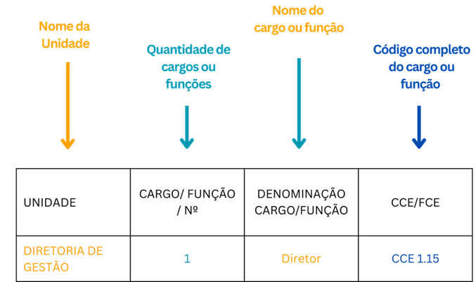
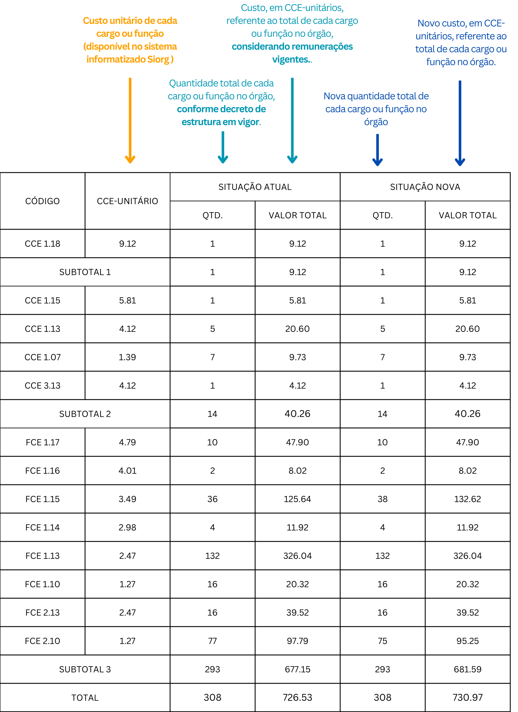
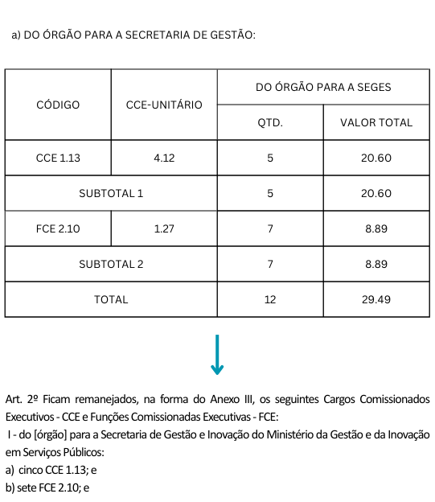

Reestruturação de órgãos da Presidência da República e dos Ministérios 
==============================================================================

Este módulo orienta, de forma prática, a revisão de estruturas organizacionais de órgãos da Presidência da República e dos Ministérios, focando nos principais anexos de um decreto de aprovação de estrutura: o Anexo I, que trata fundamentalmente da organização e das competências do órgão e de suas unidades; e o Anexo IIa, que detalha os cargos e funções que o compõem.

Anexo I: Estrutura Regimental
-----------------------------

Esta seção aborda como elaborar estruturas regimentais de órgãos da Presidência da
República e dos Ministérios. A estrutura regimental ocupa o Anexo I de um decreto
de estrutura.

Unidades e competências obrigatórias
++++++++++++++++++++++++++++++++++++

As :ref:`competencias` de cada órgão são definidas pela
`Lei que organiza a Administração Pública federal <lei-14600_>`_, usualmente publicada no início do governo em exercício na forma de medida provisória.

Propostas de alteração de estrutura devem, inicialmente, observar essa lei quanto:
 
* às competências do órgão, que devem ser replicadas no art. 1º do Anexo I do
  decreto que aprova sua estrutura regimental e que devem nortear as competências
  de todas as outras unidades subordinadas. Esse é o único artigo que compõe o
  Capítulo I: Da natureza e da competência.
 
* às unidades obrigatórias e regramentos específicos a serem observados no desenho
  da estrutura organizacional, inclusive quanto ao limite de Secretarias em cada
  Ministério.

O `art. 50 da Lei nº 14.600, de 19 de junho de 2023 <lei-14600-art50_>`_ determina que são obrigatórias as seguintes unidades, que devem ter suas competências descritas no Decreto de Estrutura:
 
* Gabinete do Ministro;
* Secretaria-Executiva, exceto no Ministério da Defesa e no Ministério das Relações
  Exteriores;
* Consultoria Jurídica;
* Ouvidoria;
* Secretarias; e
* órgão responsável pelas atividades de administração patrimonial, de material, de
  gestão de pessoas, de serviços gerais, de orçamento e finanças, de contabilidade
  e de tecnologia da informação, vinculado à Secretaria-Executiva.

Para as demais unidades que compõem o órgão, deve-se observar o disposto no
`Decreto nº 10.829, de 5 de outubro de 2021 <decreto-10829_>`_:
 
.. admonition:: Decreto nº 10.829, de 5 de outubro de 2021 — art. 5º
 
   Art. 5º  O decreto que aprovar a estrutura regimental ou o estatuto do órgão ou
   da entidade deverá discriminar, em anexo específico:
 
   I - as competências do órgão e de suas secretarias, ou equivalentes, quando se
   tratar da administração pública direta; e
 
   (...)
 
   § 1º  A discriminação de que trata o *caput* poderá ser estendida às demais
   unidades administrativas, até o limite de CCE ou FCE de nível 15, observadas
   as competências e as especificidades do órgão ou da entidade.

Atualmente, convencionou-se descrever as competências de todas as unidades de nível
15 ou superior (nível de diretoria ou departamento).
 
 
Quando as unidades estiverem subordinadas diretamente ao Ministro, entende-se que
são equivalentes às Secretarias, independentemente de seu nível, cabendo também a
discriminação de suas competências. São exemplos de unidades dessa natureza a
Ouvidoria, a Corregedoria e as Assessorias que não compõem o Gabinete do Ministro.
 
.. TODO: inserir referência à tabela de níveis associados a cada unidade
 
Assim, se a proposta cria ou extingue alguma unidade com essas características,
será necessário inserir ou excluir suas competências.
 
.. warning::
 
   A não ser que haja previsão legal, fique atento para que a proposta não traga
   alterações que gerem sombreamento de competências com outros órgãos.
 
Organização básica e elementos da estrutura regimental
++++++++++++++++++++++++++++++++++++++++++++++++++++++
 
A organização do Anexo I segue os princípios do
`Decreto nº 12.002, de 22 de abril de 2024 <decreto-12002_>`_, que estabelece as
normas gerais para elaboração, redação, alteração e consolidação de atos normativos.
Todos esses princípios devem ser observados também em propostas de alteração de
estruturas regimentais.
 
.. note::
 
   O `Decreto nº 12.002, de 22 de abril de 2024 <decreto-12002_>`_ permite compreender como estruturar
   um ato normativo, o que deve ser observado em sua redação para manter clareza,
   precisão e ordem lógica, a formatação (espaçamentos, uso de negritos e itálicos)
   e as regras para alterações e revogações.
 
   .. TODO: inserir links para as seções específicas do decreto

No caso das estruturas, a divisão do texto que trata da estrutura regimental segue
a seguinte lógica:
 
Capítulo I — DA NATUREZA E DA COMPETÊNCIA
~~~~~~~~~~~~~~~~~~~~~~~~~~~~~~~~~~~~~~~~~

Por padrão, abrange somente o art. 1º, que traz as competências do órgão:
 
"Art. 1º  O [*nome do órgão*], órgão da administração pública federal direta,
tem como área de competência os seguintes assuntos:
 
[competências idênticas às constantes na `Lei nº 14.600, de 19 de junho de 2023 <lei-14600_>`_]"
 
Capítulo II — DA ESTRUTURA ORGANIZACIONAL
~~~~~~~~~~~~~~~~~~~~~~~~~~~~~~~~~~~~~~~~

Por padrão, abrange somente o art. 2º, que traz a organização interna do órgão,
dividida da seguinte forma:

I - órgãos de assistência direta e imediata ao Ministro de Estado: engloba todas
as unidades de assessoria direta (começando pelo Gabinete do Ministro e seguindo
com suas Assessorias Especiais), unidades setoriais (Ouvidoria, Corregedoria,
Consultoria Jurídica) e a Secretaria-Executiva, com suas Subsecretarias.

II - órgãos específicos singulares: engloba as unidades finalísticas do órgão,
ou seja, as Secretarias e suas Diretorias ou Departamentos.

III - unidades descentralizadas (se houver): engloba todas as unidades situadas
em município distinto ao da sede do órgão.

IV - órgãos colegiados (se houver): engloba colegiados criados por lei, sob
responsabilidade do órgão.

V - entidades vinculadas (se houver): engloba autarquias, fundações públicas
e empresas públicas vinculadas ao órgão.  

**Exemplo simplificado**

 
.. _organograma-ministerio:
.. figure:: ../_static/images/Fig2_Organograma_Ministerio.png
   :alt: Organograma simplificado de ministério
   :align: center
 
   Organograma simplificado de ministério.
 

Capítulo III — DAS COMPETÊNCIAS DOS ÓRGÃOS
~~~~~~~~~~~~~~~~~~~~~~~~~~~~~~~~~~~~~~~~~~

Esse capítulo descreve as competências de todas as unidades organizacionais
elencadas no art. 2º, na exata ordem em que lá aparecem. Para cada grupo de
unidades, haverá uma Seção específica. Para cada unidade organizacional,
haverá um artigo.

.. note::
 
   A redação de competências segue as regras e boas práticas definidas no
   `Decreto nº 12.002, de 22 de abril de 2024 <decreto-12002_>`_.
 
   Todas as unidades setoriais têm suas atribuições gerais estabelecidas por normas
   específicas e, em alguns casos, a redação de suas competências foi padronizada
   pelo órgão central do sistema.

Como o Gabinete do Ministro é uma unidade obrigatória em todos os órgãos com status ministerial, conforme a `Lei nº 14.600, de 19 de junho de 2023 <lei-14600_>`_, o Capítulo III começa por ele.

.. admonition:: Exemplo
 
   Capítulo III: DAS COMPETÊNCIAS DOS ÓRGÃOS

   "**Seção I**
 
   **Dos órgãos de assistência direta e imediata ao Ministro de Estado X**
 
   Art. 3º  Ao Gabinete compete:
 
   I - xxx"
 
.. hint::
 
   Alterações pontuais de competências de unidades existentes serão feitas na forma
   de substituição do texto vigente. Por exemplo:
 
   "Art. 3º  O Anexo I ao Decreto nº [número do decreto com a estrutura vigente,
   com data], passa a vigorar com as seguintes alterações:
 
   "Art. 12.  .....................................................................................
 
   II - supervisionar, no âmbito do Ministério, as atividades de modernização
   administrativa;
   ........................................................................................................" (NR)
 
   Alterações pontuais que visem à criação de nova unidade serão feitas na forma de
   inserção de artigo, na ordem definida pela nova organização prevista no art. 2º.
 
   No exemplo de criação de nova unidade denominada Subsecretaria de Gestão
   Administrativa, subordinada à já existente Secretaria-Executiva, altera-se o
   art. 2º e incluem-se suas competências logo após as atualmente descritas para a
   Secretaria-Executiva (art. 12):
 
   "Art. 3º  O Anexo I ao Decreto nº [número do decreto com a estrutura vigente,
   com data], passa a vigorar com as seguintes alterações:
 
   "Art. 2º  .......................................
 
   I - ..............................................................
 
   j) Secretaria-Executiva: Subsecretaria de Gestão Administrativa;
   .....................................................................................\" (NR)
 
   "Art. 12-A  À Subsecretaria de Gestão Administrativa compete:
 
   I - assistir o Ministro de Estado na definição de diretrizes, na supervisão e na
   coordenação das atividades das Secretarias integrantes da estrutura do Ministério; e
 
   II - supervisionar, no âmbito do Ministério, as atividades de modernização
   administrativa."
 
   Nesse segundo exemplo, o quadro demonstrativo de cargos e funções (Anexo II)
   também é substituído, com a inclusão de novo bloco de cargos e funções.
 
   .. TODO: inserir link para a seção sobre o Anexo II
 

Capítulo IV — DAS ATRIBUIÇÕES DOS DIRIGENTES
~~~~~~~~~~~~~~~~~~~~~~~~~~~~~~~~~~~~~~~~~~~

Esse capítulo descreve as atribuições dos principais dirigentes do órgão, destacando-se aqueles que ocupam cargos ou funções de nível 17 ou 18.

Adota-se seções específicas, com um artigo cada, para tratar, separada e respectivamente, das atribuições do Secretário-Executivo, dos Secretários ou equivalentes e dos demais dirigentes.

 
.. admonition:: Exemplo
 
   **CAPÍTULO IV**

   **DAS ATRIBUIÇÕES DOS DIRIGENTES**

   **Seção I**

   **Do Secretário-Executivo**

   Art. 67.  Ao Secretário-Executivo incumbe:

   I - coordenar, consolidar e submeter ao Ministro de Estado o plano de ação global do Ministério;

   II - supervisionar e avaliar a execução dos projetos e das atividades do Ministério; e

   III - supervisionar e coordenar a articulação dos órgãos do Ministério com os órgãos centrais dos sistemas relacionados ao âmbito de competência da Secretaria-Executiva.

   **Seção II**

   **Dos Secretários**

   Art. 68.  Aos Secretários incumbe planejar, dirigir, coordenar, orientar, acompanhar e avaliar a execução das atividades das unidades que integram as suas Secretarias e exercer outras atribuições que lhes forem cometidas em regimento interno.

   **Seção III**

   **Dos demais dirigentes**

   Art. 69.  Ao Chefe de Gabinete do Ministro de Estado, aos Chefes de Assessorias Especiais, ao Consultor Jurídico, aos Subsecretários, aos Diretores, ao Corregedor, ao Ouvidor-Geral, aos Coordenadores-Gerais, aos Coordenadores e aos demais dirigentes incumbe planejar, dirigir, coordenar e orientar a execução das atividades de suas unidades e exercer outras atribuições que lhes forem cometidas pelo Ministro de Estado no âmbito de sua competência.

 
Anexo IIa: Quadro demonstrativo dos cargos em comissão e das funções comissionadas
----------------------------------------------------------------------------------
 
O quadro demonstrativo é um resumo do organograma do órgão descrito no art. 2º do Anexo I, representado por uma tabela. A fim de facilitar as consultas aos decretos vigentes, convencionou-se substituir esse quadro por inteiro sempre que sofre alterações.
 
Essa tabela é formada por quatro colunas e traz todos os cargos em comissão e as
funções comissionadas de que o órgão dispõe, representados por códigos, conforme mostra a :numref:`fig-anexo-ii-a`.
 
.. _fig-anexo-ii-a:

 
   Exemplo de Anexo II a — quadro demonstrativo de cargos e funções.
 
Cada cargo ou função tem um código que identifica o tipo, a categoria e o nível. A :numref:`fig-codigo-cce-fce` ilustra cada parte do código.
 
.. _fig-codigo-cce-fce:
.. figure:: ../_static/images/Fig3_codigo.png
   :alt: Estrutura do código de cargo em comissão (CCE) e função comissionada (FCE) com tipo, categoria e nível
   :align: center
   :scale: 60
 
   Estrutura do código CCE/FCE — tipo, categoria e nível.
 
Cada código possui uma ou mais denominações específicas, conforme a :numref:`Denominacoes-CCE-FCE-label`.
 
 
.. seealso::
 
   Para saber mais sobre os diferentes tipos, categorias e níveis, consulte :ref:`cce_fce`.
 
Os cargos e funções existentes no órgão são agrupados conforme regras dispostas no `Decreto nº 10.829, de 5 de outubro de 2021 <decreto-10829_>`_, que já orientou o desenho do Anexo I: se a unidade consta no art. 2º, há competência descrita e a unidade precisa ser nomeada no quadro demonstrativo. Essa unidade e os cargos e funções a ela subordinados compõem um grupo, no qual as unidades subordinadas recebem nomenclatura genérica e são apresentadas de forma agrupada.
 
.. _fig-quadro-de-cargos:
.. figure:: ../_static/images/Fig4_quadro_de_cargos.png
   :alt: Exemplo de quadro demonstrativo de cargos e funções com grupos de unidades organizadas por nível
   :align: center
 
   Exemplo de quadro demonstrativo de cargos e funções.
 
Como se observa na :numref:`fig-quadro-de-cargos`, a organização do quadro
demonstrativo respeita a seguinte ordem para cada grupo:
 
**Primeira linha do grupo**

 
* **Coluna 1:** nome da unidade específica em caixa alta (conforme art. 2º do
  Anexo I);
 
* **Coluna 2:** 1, uma vez que só é possível haver um chefe para a unidade;
 
* **Coluna 3:** nome do cargo ou função da chefia da unidade (que não pode se
  repetir no mesmo grupo); e
 
* **Coluna 4:** código do cargo ou função do chefe da unidade, necessariamente
  de categoria 1 (direção), no maior nível do grupo.
 
**Segunda linha**

 
Cargo ou função da chefia adjunta, se o grupo for chefiado por cargo ou função
de nível 17 ou 18:
 
* **Coluna 1:** vazio (já que um adjunto não chefia unidade);
 
* **Coluna 2:** quantidade de chefias adjuntas (usualmente limitada a 1);
 
* **Coluna 3:** nome do cargo ou função da chefia da unidade seguido do termo
  "Adjunto"; e
 
* **Coluna 4:** código do cargo ou função com o segundo maior nível do grupo,
  necessariamente de categoria 1 (direção).
 
.. note::
 
   O Adjunto é o único cargo ou função de categoria 1 que não chefia unidade —
   a todos os demais deve ser associada uma unidade sem nomenclatura específica.
 
**Linhas seguintes**

 
Observam a ordem decrescente de nível. Dentro do mesmo nível, observa-se a ordem
crescente da categoria. Se existe um cargo e uma função com a mesma categoria e
o mesmo nível, o cargo (CCE) é posicionado antes da função (FCE).
 
Finalizada a descrição do grupo, pula-se uma linha da tabela e inicia-se o grupo
com a próxima unidade descrita no art. 2º do Anexo I.
 
.. admonition:: Pontos de atenção
 
   #. O cargo do Ministro não consta no quadro.
 
   #. Os primeiros cargos e funções constantes na tabela serão os que assessoram
      diretamente o Ministro (categorias 2 ou 3).
 
   #. Os CCE ou as FCE de mesma denominação não podem ter relação de subordinação
      entre si.
 
   #. Todas as alterações realizadas por portaria ministerial devem ser consideradas
      no novo quadro demonstrativo (e no quadro resumo de custos), já que esse será
      o retrato mais recente da estrutura do órgão. Alterações não incorporadas
      — ainda que acidentalmente — exigirão nova portaria ministerial de realocação
      ou permuta e, provavelmente, novos atos de nomeação ou designação.
 
   #. O custo da estrutura proposta deve ser avaliado antes de sua construção.
      Propostas com impacto orçamentário dependem da disponibilidade de cargos e
      funções na reserva técnica e exigem articulação junto à Seges, podendo não
      ser acatadas em sua integralidade, ainda que cumpram requisitos legais e de
      boas práticas.
 

Demais tabelas que compõem um decreto de estrutura regimental
-------------------------------------------------------------
 
Anexo IIb: Quadro resumo de custos
++++++++++++++++++++++++++++++++++
 
O Quadro resumo de custos informa o tamanho da estrutura organizacional de um
órgão ou entidade em CCE-unitários (:ref:`cce-unitario`).
 
Quando a estrutura está sendo alterada, esse quadro demonstra a situação nova em
relação à situação atual, agregando os cargos e funções de mesmo código e
mostrando seu somatório.
 
.. _quadro-custos:

 
   Exemplo de quadro resumo de custos
 
A planilha disponibilizada pelo Departamento de Modelos Organizacionais produz
esse quadro automaticamente a partir do novo quadro demonstrativo informado
pelo órgão.
 
.. warning::
 
   A situação atual no quadro resumo de custos reflete o **decreto vigente** —
   não as portarias ministeriais posteriores a ele. No entanto, o novo quadro
   proposto deve incorporar todas as alterações já realizadas por portaria,
   representando o retrato real da estrutura a ser substituída.
 
 
Anexos IIIa e IIIb: Remanejamentos de CCE e FCE
+++++++++++++++++++++++++++++++++++++++++++++++
 
.. seealso::
 
   Para entender o que é o remanejamento e por que é realizado, consulte a seção
   :ref:`reserva_tec`.
 
As tabelas constantes nos Anexos III a e III b trazem, respectivamente, a lista
dos cargos e funções remanejados do órgão para a Seges e da Seges para o órgão.
 
Assim como nos demais anexos, essas tabelas consideram a estrutura publicada no
decreto vigente e contêm os custos de cada remanejamento. As informações constantes
nessas tabelas devem ser idênticas àquelas listadas no corpo do decreto.
 
.. _remanejamento:

 
   Exemplo de tabela de remanejamento e o correspondente texto no corpo do decreto
 
A planilha disponibilizada pelo Departamento de Modelos Organizacionais produz
esses quadros automaticamente a partir do novo quadro demonstrativo informado
pelo órgão.
 
 
Anexo IV: Transformações de CCE e FCE
+++++++++++++++++++++++++++++++++++++
 
A tabela constante no Anexo IV é exigida pelo
`art. 7º da Lei nº 14.204, de 16 de setembro de 2021 <lei-14204-art7_>`_ e
informa as transformações de cargos e funções existentes para viabilizar a
estrutura pretendida. O objetivo dessa tabela é demonstrar que não houve aumento
de despesa no ato da transformação — a conta final deve ser sempre igual a zero
ou negativa.
 
Existem dois cenários para a geração dessa tabela:
 
#. **A proposta parte dos cargos e funções já disponíveis no órgão ou entidade**
   — os cargos e funções que deixam de existir têm custo total igual ou maior ao
   dos novos. Nesse caso, a planilha disponibilizada pelo Departamento de Modelos
   Organizacionais produz o quadro automaticamente a partir do novo quadro
   demonstrativo informado pelo órgão.

   No exemplo ilustrado, foram retirados da reserva técnica dois CCE de nível 15,
   resultando na tabela apresentada na :numref:`sem-impacto`

   .. _sem-impacto:
   .. figure:: ../_static/images/fig8-transf-sem-impacto.png
      :alt: Transformação com impacto orçamentário
      :align: center
 
      Exemplo de transformação sem impacto orçamentário

 
#. **A proposta implica ganho de estrutura com impacto orçamentário** — os cargos
   e funções que deixam de existir têm custo inferior aos que serão necessários à
   nova estrutura, gerando despesa na transformação, conforme mostra a :numref:`impacto`.
 
   .. _impacto:
   .. figure:: ../_static/images/fig7-transf-com-impacto.png
      :alt: Transformação com impacto orçamentário
      :align: center
 
      Exemplo de transformação com impacto orçamentário
 
   Nesse caso, é necessário que a Seges verifique a disponibilidade dos cargos e
   funções faltantes em sua reserva técnica e determine se será necessário
   transformá-los, sem que esse ato implique aumento de despesa. A tabela deverá
   ser gerada pela equipe do Departamento de Modelos Organizacionais.

Unidades administrativas da administração direta e suas regras específicas
--------------------------------------------------------------------------
 
As regras a seguir focam na estruturação hierárquica das unidades, chefiadas por
ocupantes de cargos e funções da categoria 1. No entanto, outros tipos de cargos
e funções (categorias 2, 3 e 4), que não são visíveis no organograma do órgão,
podem compor a estrutura de cada unidade.
 
A regra básica para definir se um cargo ou função pode ser inserido em dada unidade
é: se o nível for menor do que o atribuído ao titular, é possível alocá-lo na
unidade. Para mais informações veja :ref:`categorias`
 
 
Órgãos de assistência direta e imediata ao Ministro de Estado
+++++++++++++++++++++++++++++++++++++++++++++++++++++++++++++
 
Gabinete do Ministro
~~~~~~~~~~~~~~~~~~~~
 
Unidade obrigatória: sim
 
Nomenclatura permite complemento: não
 
Sobre o titular: Chefe de Gabinete, ocupante de cargo ou função, necessariamente
de código 1.15 ou 1.16 em Ministérios. Em órgãos da Presidência da República,
foi convencionado o código 1.17.
 
Sobre as competências: necessariamente descritas em Decreto.
 
.. TODO: desenvolver sugestão mínima de competências do Gabinete do Ministro
.. TODO: desenvolver conteúdo sobre competências condicionais (ex.: cerimonial)
 
Assessoria Especial de Controle Interno
~~~~~~~~~~~~~~~~~~~~~~~~~~~~~~~~~~~~~~~
 
Unidade obrigatória: não, mas é necessário que o órgão conte ao menos com um
Assessor Especial responsável pela temática.
 
Nomenclatura permite complemento: não
 
Sobre o titular: Chefe de Assessoria Especial, necessariamente FCE 1.15.
 
Sobre as competências: necessariamente descritas em Decreto, definidas pelo
`art. 13 do Decreto nº 3.591, de 6 de setembro de 2000 <decreto-3591-art13_>`_.
 
.. admonition:: Outras informações
 
   Apesar de apoiar o Sistema de Controle Interno do Poder Executivo Federal,
   instituído pelo
   `Decreto nº 3.591, de 6 de setembro de 2000 <decreto-3591_>`_, as Assessorias
   Especiais de Controle Interno não são órgãos setoriais desse Sistema, papel
   esse reservado às Secretarias de Controle Interno da Casa Civil, da
   Advocacia-Geral da União, do Ministério das Relações Exteriores e do
   Ministério da Defesa.
 
Outras Assessorias e Assessorias Especiais
~~~~~~~~~~~~~~~~~~~~~~~~~~~~~~~~~~~~~~~~~~
 
Unidades obrigatórias: não
 
Nomenclatura permite complemento: sim, necessariamente.
 
Sobre o titular: Chefe de Assessoria, de código 1.13 ou 1.14, no caso da
Assessoria; Chefe de Assessoria Especial, de código 1.15 ou 1.16, no caso da
Assessoria Especial, independentemente da denominação complementar da unidade.
 
A escolha do nível da Assessoria depende da complexidade dos processos analisados
e do número de servidores atuantes na unidade.
 
Sobre as competências: descritas em decreto se nível 15 ou 16 (Assessoria
Especial), ou se não estiver subordinada a outra unidade (Assessoria).
 
Serão definidas a partir da temática específica, devendo sempre estar associadas
à assistência direta ao Ministro, em assuntos de interesse do Ministério, que
envolvam conhecimentos e articulações que ultrapassam aqueles das unidades
finalísticas.
 
São Assessorias típicas:
 
* Assessoria de Participação Social e Diversidade
* Assessoria de Relações Internacionais
* Assessoria de Comunicação Social
* Assessoria Parlamentar
 
.. warning::
 
   O uso da denominação "Assessoria" para designar uma unidade é restrito àquela
   de assistência direta e imediata ao Ministro de Estado — a existência de
   assessores não implica a constituição de unidade administrativa desse tipo.
 
 
Órgãos setoriais
++++++++++++++++
 
São aquelas unidades que executam atividades comuns a todos os órgãos, sob
coordenação de um órgão central, formando um sistema estruturador.
 
Ouvidoria
~~~~~~~~~
 
Unidade obrigatória: sim
 
Nomenclatura permite complemento: sim, em casos excepcionais, quando se tratar
de Ouvidoria que contemple atividades que extrapolam a atuação do órgão (a
exemplo da Ouvidoria-Geral do Sistema Único de Saúde e Ouvidoria Nacional dos
Direitos Humanos).
 
Sobre o titular: Ouvidor, CCE ou FCE, usualmente de código 1.13 ou 1.14, exceto
quando responsável por atividades de alta complexidade e capilaridade.
 
Sistema estruturador associado: Sistema de Ouvidoria do Poder Executivo federal,
instituído pelo
`Decreto nº 9.492, de 5 de setembro de 2018 <decreto-9492_>`_.
 
Órgão central do sistema: Controladoria-Geral da União, por meio da
Ouvidoria-Geral da União.
 
Sobre as competências: necessariamente descritas em Decreto, definidas pelo
`art. 10 do Decreto nº 9.492, de 5 de setembro de 2018 <decreto-9492-art10_>`_.
 
.. admonition:: Outras informações
 
   A nomeação, a designação, a exoneração ou a dispensa dos titulares das
   unidades setoriais do Sistema de Ouvidoria do Poder Executivo federal será
   submetida, pelo dirigente máximo do órgão ou da entidade, à aprovação da
   Controladoria-Geral da União.
 
Corregedoria
~~~~~~~~~~~~
 
Unidade obrigatória: não
 
Nomenclatura permite complemento: não
 
Sobre o titular: Corregedor, CCE ou FCE, usualmente de código 1.13 ou 1.14.
 
Sistema estruturador associado: Sistema de Correição do Poder Executivo Federal,
instituído pelo
`Decreto nº 5.480, de 30 de junho de 2005 <decreto-5480_>`_.
 
Órgão central do sistema: Controladoria-Geral da União, por meio da
Corregedoria-Geral da União.
 
Sobre as competências: necessariamente descritas em Decreto, definidas pelo
`art. 5º do Decreto nº 5.480, de 30 de junho de 2005 <decreto-5480-art5_>`_.
 
.. admonition:: Outras informações
 
   A indicação dos titulares das unidades setoriais de correição será submetida
   previamente à apreciação do Órgão Central do Sistema de Correição. Os critérios
   para nomeação ou designação são definidos pelo
   `art. 8º do Decreto nº 5.480, de 30 de junho de 2005 <decreto-5480-art8_>`_.
 
Consultoria Jurídica
~~~~~~~~~~~~~~~~~~~~
 
Unidade obrigatória: sim
 
Nomenclatura permite complemento: não
 
Sobre o titular: Consultor Jurídico, necessariamente FCE, usualmente de código
1.15.
 
Sobre as competências: necessariamente descritas em Decreto, definidas pelo
`art. 11 da Lei Complementar nº 73, de 10 de fevereiro de 1993 <lc-73-art11_>`_.
 
As Consultorias Jurídicas junto aos Ministérios são órgãos de execução da
Consultoria-Geral da União (da Advocacia-Geral da União). Integram a estrutura
organizacional dos respectivos Ministérios, sendo subordinadas administrativamente
ao Ministro, mas nos aspectos técnico e jurídico, subordinam-se ao
Consultor-Geral da União e ao Advogado-Geral da União.
 
 
Secretaria-Executiva
++++++++++++++++++++
 
Unidade obrigatória: sim
 
Nomenclatura permite complemento: não
 
Sobre o titular: Secretário-Executivo, necessariamente de código CCE 1.18.
 
Sistemas estruturadores usualmente associados:
 
* Sistema de Planejamento e de Orçamento Federal
* Sistema de Administração Financeira Federal
* Sistema de Organização e Inovação Institucional — SIORG
* Sistema de Gestão de Documentos de Arquivo — SIGA
* Sistema de Pessoal Civil da Administração Federal — SIPEC
* Sistema de Serviços Gerais — SISG
* Sistema de Contabilidade Federal
 
Sobre as competências: necessariamente descritas em Decreto.
 
.. admonition:: Sugere-se
 
   "Compete à Secretaria-Executiva:
 
   I - assistir o Ministro de Estado na definição de diretrizes e na supervisão e
   coordenação das atividades das Secretarias integrantes da estrutura do Ministério
   [e de suas entidades vinculadas (quando houver)]; e
 
   II - orientar, no âmbito do Ministério, a execução das atividades de administração
   patrimonial e das atividades relacionadas aos sistemas federais de planejamento e
   de orçamento, de contabilidade, de administração financeira, de administração dos
   recursos de informação e informática, de recursos humanos, de organização e
   inovação institucional e de serviços gerais.
 
   Parágrafo único.  A Secretaria-Executiva exerce a função de órgão setorial dos
   Sistemas de Planejamento e de Orçamento Federal, de Administração Financeira
   Federal, de Organização e Inovação Institucional — SIORG, de Gestão de Documentos
   de Arquivo — SIGA, de Pessoal Civil da Administração Federal — SIPEC, de Serviços
   Gerais — SISG, de Contabilidade Federal e de Administração dos Recursos de
   Tecnologia da Informação — SISP."
 
Caso o órgão integre o Centro de Serviços Compartilhados Colaboragov, a Secretaria
de Serviços Compartilhados, do Ministério da Gestão e da Inovação em Serviços
Públicos, atua como órgão setorial desses sistemas, nos termos do
`Decreto nº 11.837, de 21 de dezembro de 2023 <decreto-11837_>`_.
 
Regras específicas sobre a estrutura de cargos e funções que compõem a
Secretaria-Executiva:
 
#. Foi convencionado que todos os Secretários-Executivos contarão com um
   Secretário-Executivo Adjunto, CCE ou FCE, de código 1.17.
 
#. A Secretaria-Executiva é usualmente estruturada em Subsecretarias (chefiadas
   por um Subsecretário, ocupante de CCE ou FCE, de código 1.15 ou 1.16), com
   competências e estrutura delimitadas em decreto. Os órgãos que aderiram ao
   Centro de Serviços Compartilhados Colaboragov costumam contar, em suas
   estruturas, com uma única unidade voltada à gestão das atividades dos sistemas
   estruturadores acima mencionados (uma Diretoria de Gestão e Administração ou
   uma Subsecretaria de Administração).
 
.. admonition:: Outras informações
 
   Cabe ao Secretário-Executivo exercer a função de substituto do Ministro de
   Estado, conforme disposto no
   `Decreto nº 8.851, de 20 de setembro de 2016 <decreto-8851_>`_.
 
 
Órgãos específicos singulares
+++++++++++++++++++++++++++++
 
Secretarias
~~~~~~~~~~~
 
Unidade obrigatória: ao menos uma, no limite da quantidade eventualmente
estabelecida na lei que estabelece a organização básica dos órgãos da Presidência
da República e dos Ministérios.
 
Nomenclatura permite complemento: sim, necessariamente.
 
Sobre o titular: Secretário, CCE ou FCE, necessariamente de código 1.17.
 
Sobre as competências: necessariamente descritas em Decreto.
 
As Secretarias devem ser organizadas de forma que o órgão seja capaz de exercer
todas as competências definidas na lei que estabelece a organização básica dos
órgãos da Presidência da República e dos Ministérios. Por regra, uma Secretaria
é responsável por uma ou mais das competências atribuídas ao órgão.
 
Regras específicas sobre a estrutura de cargos e funções que compõem as Secretarias:
 
#. As Secretarias usualmente contam com um Gabinete (chefiado por um Chefe de
   Gabinete, ocupante de CCE ou FCE de código 1.13 ou 1.14, sem competências ou
   estrutura discriminada em Decreto) e um Secretário-Adjunto, de código 1.15 ou
   1.16.
 
#. Às Secretarias se subordinam Diretorias ou Departamentos, responsáveis por
   executar as atividades, políticas e programas planejados no âmbito da Secretaria.
 
#. É possível estruturar uma ou mais unidades de nível 14 ou menor para atuação
   na assistência direta ao Secretário. No entanto, sugere-se cautela nessa medida,
   a fim de manter a racionalidade do desenho organizacional da unidade, evitando
   sobreposição à atuação dos Departamentos e Diretorias.
 
Departamentos e Diretorias
~~~~~~~~~~~~~~~~~~~~~~~~~~
 
Unidade obrigatória: não
 
Nomenclatura permite complemento: sim, necessariamente.
 
Sobre o titular: Diretor, CCE ou FCE, código 1.15 ou 1.16, a depender do volume
de processos e pessoal subordinado, e da complexidade da atuação.
 
Sobre as competências: necessariamente descritas em Decreto.
 
Os Departamentos ou Diretorias devem ser organizados de forma a dar concretude
às competências da Secretaria à qual estejam subordinados. Nesse sentido, suas
competências devem, necessariamente, ser desdobramentos daquelas da Secretaria.
 
Regras específicas sobre a estrutura de cargos e funções que compõem as Diretorias
e Departamentos:
 
#. Não é desejável a estruturação de gabinete em Diretorias e Departamentos.
 
#. Às Diretorias e Departamentos podem se subordinar todas as unidades e cargos
   e funções de nível inferior àquele atribuído ao Diretor, à exceção das unidades
   reservadas à assessoria direta e imediata ao Ministro.
 
#. Todas as unidades, cargos e funções subordinados às Diretorias e Departamentos
   comporão um único bloco, organizando-se conforme regras associadas ao Quadro
   demonstrativo dos cargos em comissão e das funções comissionadas.
 
Outras Unidades
~~~~~~~~~~~~~~~
 
Unidades obrigatórias: não
 
Nomenclatura permite complemento: não
 
Sobre o titular:
 
.. TODO: inserir referência à tabela de titulares por tipo de unidade
 
Sobre as competências: não constam em Decreto, mas precisam ser inseridas no
sistema informatizado Siorg.
 
Regra específica sobre a estrutura de cargos e funções que compõem as demais
unidades: devem ser agrupados, abaixo da Diretoria ou Departamento superior,
conforme regras associadas ao Quadro demonstrativo dos cargos em comissão e das
funções comissionadas.
 
Unidades descentralizadas
~~~~~~~~~~~~~~~~~~~~~~~~~
 
O termo se refere à descentralização física, ou seja, às unidades do órgão
situadas em município diferente do da sede e que executam ações em nível local.
 
Unidades obrigatórias: não
 
Sobre a nomenclatura da unidade: definida conforme atuação. São exemplos comuns
as Superintendências Federais.
 
Sobre o titular: nomenclatura definida conforme a da unidade (por exemplo,
Superintendente). O titular será ocupante de CCE ou FCE de categoria 1, com nível
definido pelo órgão, conforme volume de processos e pessoas alocadas, e nível de
complexidade.
 
.. warning::
 
   Na definição da nomenclatura da unidade descentralizada, não devem ser
   utilizadas as seguintes denominações: "Secretaria"; "Gabinete";
   "Secretaria-Executiva"; "Secretaria de Controle Interno"; "Departamento";
   "Diretoria" e "Coordenação-Geral".
 
Sobre as competências: necessariamente descritas em Decreto, em seção própria,
independentemente da subordinação. A subordinação deve constar no caput do artigo
específico.
 
.. admonition:: Exemplo
 
   "Seção III
 
   Das unidades descentralizadas
 
   Art. [XX].  Às Superintendências Federais, supervisionadas pela
   [*nome da unidade*], compete executar:
 
   I - ..."
 
Regras específicas sobre a estrutura de cargos e funções que compõem as unidades
descentralizadas:
 
#. As unidades descentralizadas são inseridas de forma agrupada, por unidade
   superior, em um único bloco de cargos e funções, organizado conforme regras
   associadas ao Quadro demonstrativo dos cargos em comissão e das funções
   comissionadas. Essa regra é válida também quando há variação dos níveis dos
   titulares entre unidades de mesma nomenclatura.
 
#. Às unidades descentralizadas podem se subordinar todas as unidades e cargos e
   funções de nível inferior àquele atribuído aos titulares.

.. _unidades-descentralizadas:
.. figure:: ../_static/images/fig-unid-descentr-adm-direta.png
   :alt: Unidades descentralizadas no Anexo II
   :align: center
 
   Exemplo de unidades descentralizadas no Anexo II.
 
 
Órgãos colegiados
+++++++++++++++++
 
Os órgãos colegiados são os órgãos integrados por mais de uma autoridade, nos
quais a decisão é tomada de forma coletiva, com o aproveitamento de experiências
diferenciadas. Seus representantes podem ser originários do setor público, do
setor privado ou da sociedade civil, segundo a natureza da representação. São
conhecidos pelos nomes de Conselhos, Comitês, Câmaras, Comissões, entre outros.
 
Alguns órgãos ou entidades do Poder Executivo federal dispõem, dentro de seu
sistema de governança organizacional, de órgãos colegiados de caráter
deliberativo, consultivo ou judicante, criados com o propósito de contribuir para
o processo decisório institucional de condução de determinada política pública.
Esses colegiados participam das decisões sobre os rumos das políticas e não sobre
questões de gestão interna dos órgãos aos quais se vinculam.
 
Esses órgãos, embora previstos na estrutura organizacional, não dispõem de
estrutura interna de cargos e se constituem por representantes de órgãos e
entidades do Poder Público e, em alguns casos, também de entidades privadas
(composição pluripessoal). Seus membros não detêm cargos pela participação no
conselho e não recebem remuneração de qualquer natureza por essa função.
Normalmente, a presidência do conselho é atribuição do cargo de dirigente maior
do órgão ou entidade ao qual ele está subordinado.
 
A criação de colegiados, a ser tratada em ato normativo à parte do decreto de
estrutura regimental ou estatuto, deve observar os critérios estabelecidos no
Capítulo VI do
`Decreto nº 12.002, de 22 de abril de 2024 <decreto-12002_>`_.
 
 
Entidades vinculadas
++++++++++++++++++++
 
.. admonition:: Em desenvolvimento
 
   O conteúdo desta seção será desenvolvido em versão posterior deste manual.
 
 
Estruturas atípicas
+++++++++++++++++++
 
Procuradoria-Geral da Fazenda Nacional
~~~~~~~~~~~~~~~~~~~~~~~~~~~~~~~~~~~~~~~
 
Unidade prevista exclusivamente no Ministério da Fazenda.
 
Sobre o titular: Procurador-Geral, necessariamente de código CCE 1.18.
 
Sobre as competências: necessariamente descritas em Decreto, definidas pelo
`art. 12 da Lei Complementar nº 73, de 10 de fevereiro de 1993 <lc-73-art12_>`_.
 
A Procuradoria-Geral da Fazenda Nacional é órgão de direção da Advocacia-Geral
da União. Integra a estrutura organizacional do Ministério da Fazenda, sendo
subordinada administrativamente ao Ministro da pasta, mas, nos aspectos técnico
e jurídico, subordina-se ao Advogado-Geral da União.
 
São também órgãos de execução da Advocacia-Geral da União, que devem ser previstos
na estrutura do Ministério da Fazenda:
 
* as Procuradorias Regionais da Fazenda Nacional; e
* as Procuradorias da Fazenda Nacional nos Estados e no Distrito Federal e as
  Procuradorias Seccionais destas.
 
Secretaria de Controle Interno
~~~~~~~~~~~~~~~~~~~~~~~~~~~~~~~
 
Unidade prevista somente na Casa Civil, na Advocacia-Geral da União, no Ministério
das Relações Exteriores e no Ministério da Defesa.
 
Sobre o titular: Secretário, necessariamente de código FCE 1.15.
 
Sistema estruturador associado: Sistema de Controle Interno do Poder Executivo
Federal, instituído pelo
`Decreto nº 3.591, de 6 de setembro de 2000 <decreto-3591_>`_.
 
Órgão central do sistema: Controladoria-Geral da União.
 
Sobre as competências: necessariamente descritas em Decreto, definidas pelo
`art. 12 do Decreto nº 3.591, de 6 de setembro de 2000 <decreto-3591-art12_>`_.
 
Secretaria-Geral
~~~~~~~~~~~~~~~~
 
Unidade prevista somente no Ministério das Relações Exteriores e no Ministério
da Defesa.
 
Sobre o titular: Secretário-Geral, necessariamente de código CCE 1.18.
 
Sobre as competências: necessariamente descritas em Decreto.
 
Diferentemente dos demais órgãos da administração direta, nos quais o Ministro
exerce a representação política e a direção central das unidades internas, no MRE
e no MD essa segunda função é mediada pelo Secretário-Geral.
 
Assim, a Secretaria-Geral recebe discriminação específica no art. 2º do Anexo I,
com estrutura própria de assessoria direta, que atua também como autoridade
hierárquica superior aos órgãos singulares:
 
.. admonition:: Exemplo — art. 2º do Anexo I
 
   "Art. 2º  ...
 
   [estrutura específica do órgão, incluindo quanto aos órgãos de assessoria direta
   e imediata ao Ministro]
 
   II - órgão central de direção: Secretaria-Geral;
 
   III - órgãos de assessoria ao Secretário-Geral:
 
   a) Gabinete do Secretário-Geral;
 
   b) Órgão setorial I;
 
   (...)
 
   g) Órgão específico singular I:
 
   1. Departamento;
 
   2. Departamento;
 
   (...)"
 
Essa organização se reflete também na descrição das competências, onde as
competências da Secretaria-Geral constam em seção específica — denominada
"Do órgão central de direção" —, assim como as dos órgãos de assessoria direta:
 
.. admonition:: Exemplo — estrutura do Capítulo III
 
   "CAPÍTULO III
 
   DAS COMPETÊNCIAS DOS ÓRGÃOS
 
   Seção I
 
   Dos órgãos de assistência direta e imediata ao Ministro
 
   (...)
 
   Seção II
 
   Do órgão central de direção
 
   Art. 10.  À Secretaria-Geral compete:
 
   (...)
 
   Seção III
 
   Dos órgãos de assessoria ao Secretário-Geral
 
   Art. 11.  Ao Gabinete do Secretário-Geral compete:
 
   (...)"
 
 
Outras regras a serem observadas
++++++++++++++++++++++++++++++++
 
* Não deve haver unidades administrativas denominadas "Presidência",
  "Vice-Presidência", "Diretoria-Adjunta", "Direção", "Chefia" e outras análogas.
 
* Deve ser evitado o uso da denominação "Secretaria Executiva" para unidade
  diversa da prevista no `art. 50 da Lei nº 14.600, de 19 de junho de 2023 <lei-14600-art50_>`_.
 
* Evitar a divisão vertical da estrutura organizacional em mais de quatro níveis
  hierárquicos (a contar da unidade DAS/FCPE nível 6 ou, na ausência deste, a
  contar da unidade de nível imediatamente inferior, no caso dos Ministérios e
  Órgãos da Presidência da República, e a contar do nível 5 no caso das autarquias
  e fundações), para agilizar a tomada de decisão e reduzir a necessidade de
  ajustes no curto prazo nos níveis mais baixos. Esta diretriz não se aplica às
  unidades descentralizadas nem às Funções Gratificadas.
 
  .. TODO: inserir :numref: das figuras sobre níveis hierárquicos máximos
 
* Evitar a existência ou criação de unidades administrativas com menos de sete
  profissionais, para aumentar a amplitude de comando e reduzir a fragmentação
  organizacional.

.. ---------------------------------------------------------------------------
.. Referências externas — legislação
.. ---------------------------------------------------------------------------
 
.. _lei-14600: https://www.planalto.gov.br/ccivil_03/_ato2023-2026/2023/lei/L14600.htm
.. _lei-14600-art50: https://www.planalto.gov.br/ccivil_03/_ato2023-2026/2023/lei/L14600.htm#Art50
.. _decreto-10829: https://www.planalto.gov.br/ccivil_03/_ato2019-2022/2021/decreto/D10829.htm
.. _decreto-12002: https://www.planalto.gov.br/ccivil_03/_ato2023-2026/2024/decreto/D12002.htm
.. _lc-73: https://www.planalto.gov.br/ccivil_03/leis/lcp/Lcp73.htm
.. _lc-73-art11: https://www.planalto.gov.br/ccivil_03/leis/lcp/Lcp73.htm#Art11
.. _lc-73-art12: https://www.planalto.gov.br/ccivil_03/leis/lcp/Lcp73.htm#Art12
.. _decreto-3591: https://www.planalto.gov.br/ccivil_03/decreto/D3591.htm
.. _decreto-3591-art12: https://www.planalto.gov.br/ccivil_03/decreto/D3591.htm#Art12
.. _decreto-3591-art13: https://www.planalto.gov.br/ccivil_03/decreto/D3591.htm#Art13
.. _decreto-5480: https://www.planalto.gov.br/ccivil_03/_ato2003-2006/2005/decreto/D5480.htm
.. _decreto-5480-art5: https://www.planalto.gov.br/ccivil_03/_ato2003-2006/2005/decreto/D5480.htm#Art5
.. _decreto-5480-art8: https://www.planalto.gov.br/ccivil_03/_ato2003-2006/2005/decreto/D5480.htm#Art8
.. _decreto-8851: https://www.planalto.gov.br/ccivil_03/_ato2015-2018/2016/decreto/D8851.htm
.. _decreto-9492: https://www.planalto.gov.br/ccivil_03/_ato2015-2018/2018/decreto/D9492.htm
.. _decreto-9492-art10: https://www.planalto.gov.br/ccivil_03/_ato2015-2018/2018/decreto/D9492.htm#Art10
.. _decreto-11837: https://www.planalto.gov.br/ccivil_03/_ato2023-2026/2023/decreto/D11837.htm
.. _lei-14204: https://www.planalto.gov.br/ccivil_03/_ato2019-2022/2021/lei/L14204.htm
.. _lei-14204-art6: https://www.planalto.gov.br/ccivil_03/_ato2019-2022/2021/lei/L14204.htm#Art6
.. _lei-14204-art7: https://www.planalto.gov.br/ccivil_03/_ato2019-2022/2021/lei/L14204.htm#Art7
 