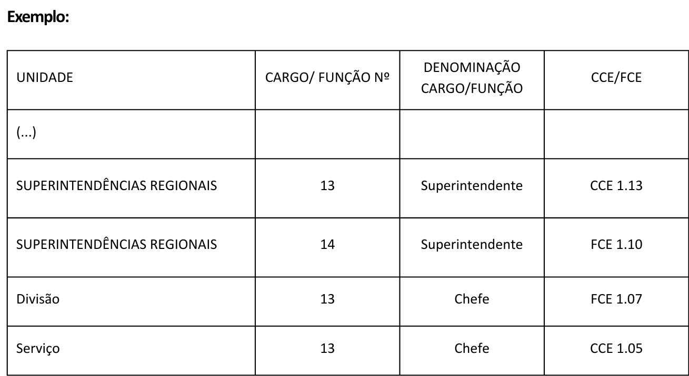

Reestruturação de autarquias e fundações públicas
=============================================================
 
Este módulo orienta, de forma prática, a revisão de estruturas organizacionais de autarquias e fundações públicas, focando nos principais anexos de um decreto de aprovação de estrutura: o Anexo I, que trata fundamentalmente da organização e das competências da entidade e de suas unidades; e o Anexo IIa, que detalha os cargos e funções que a compõem.

Anexo I: Estrutura Regimental ou Estatuto
-----------------------------------------

Conhecimentos básicos: unidades e competências obrigatórias
+++++++++++++++++++++++++++++++++++++++++++++++++++++++++++
 
A natureza e a finalidade, a sede e as competências de uma entidade da
administração indireta são definidas pela respectiva lei de criação e devem ser
reproduzidas no Capítulo I do Anexo I do decreto.
 
Propostas de alteração de estrutura devem observar, inicialmente, quanto à lei
instituidora:
 
* o local da sede;
 
* as competências legais da entidade, que devem nortear as competências de todas
  as outras unidades subordinadas;
 
* a vinculação ministerial, se não houver lei posterior; e
 
* as unidades obrigatórias e regramentos específicos a serem observados no
  desenho da estrutura organizacional, inclusive quanto ao limite de Diretorias
  e à forma e composição da direção.
 
O `Decreto nº 10.829, de 5 de outubro de 2021 <decreto-10829_>`_ determina a
necessidade de descrição das competências da entidade e de suas diretorias, ou
equivalentes.
 
.. warning::
 
   Quando as unidades estiverem subordinadas diretamente à autoridade máxima da
   entidade, entende-se que são equivalentes às Diretorias, independentemente de
   seu nível, cabendo também a discriminação de suas competências. São exemplos
   de unidades dessa natureza o Gabinete e as Assessorias que não compõem o
   Gabinete do Presidente, assim como:
 
   * órgãos seccionais, como a Procuradoria Federal, a Auditoria Interna, a
     Ouvidoria e a Corregedoria; e
 
   * órgãos colegiados, como Conselho Diretor, Conselho Consultivo e Conselho
     Deliberativo.
   
   Para saber mais sobre níveis de cargos e funções e sua relação com a estrutura organizacional, consulte :ref:`hierarquia`.

Assim, se a proposta cria ou extingue alguma unidade com essas características,
será necessário inserir ou excluir suas competências no anexo específico do
decreto que aprova sua estrutura.
 
.. warning::
 
   A não ser que haja previsão legal, fique atento para que a proposta não traga
   alterações que gerem sombreamento de competências com órgãos ou outras entidades.
 
 
Organização básica e elementos da estrutura regimental ou estatuto
++++++++++++++++++++++++++++++++++++++++++++++++++++++++++++++++++
 
A organização do Anexo I segue os princípios definidos pelo
`Decreto nº 12.002, de 22 de abril de 2024 <decreto-12002_>`_, que estabelece as
normas gerais para elaboração, redação, alteração e consolidação de atos
normativos. Todos esses princípios devem ser observados também em propostas de
alteração de estruturas regimentais.
 
.. note::
 
   O `Decreto nº 12.002, de 22 de abril de 2024 <decreto-12002_>`_ permite
   compreender como estruturar um ato normativo, o que deve ser observado em sua
   redação para manter a clareza, precisão e ordem lógica, a formatação (como
   espaçamentos, uso de negritos e itálicos) e as regras para alterações e
   revogações.

 
No caso das estruturas organizacionais das entidades, a divisão do texto que trata
da estrutura regimental (autarquias) ou estatuto (fundação pública) segue, de forma
geral, a seguinte lógica, com pequenas variações:
 
Capítulo I — DA NATUREZA E DA COMPETÊNCIA
~~~~~~~~~~~~~~~~~~~~~~~~~~~~~~~~~~~~~~~~~
 
Por padrão, abrange o art. 1º, que informa a denominação e a sigla da entidade,
sua lei de criação, sua natureza jurídica, o órgão ao qual se vincula e sua sede,
sem ordem específica.
 
No Capítulo I devem constar, ainda, as finalidades ou competências da entidade,
espelhando, tanto quanto possível, sua lei de criação ou autorização.
 
.. admonition:: Exemplo — estrutura básica
 
   "Art. 1º  O/A [nome da entidade], [natureza jurídica: autarquia ou fundação
   pública], criada pela Lei nº [número e data de publicação], tem sede em
   [município e estado].
 
   Parágrafo único.  O/A [nome da entidade] tem como finalidade:
 
   [finalidades idênticas às constantes na lei de criação]
 
   Art. 2º  Ao/À [sigla da entidade] compete:
 
   [competências idênticas às constantes na lei de criação, se houver]"
 
.. warning::
 
   Embora não haja exigência de rigidez formal na redação — contanto que preserve
   o conteúdo —, diferenças entre as competências previstas no decreto que aprova
   a estrutura e àquelas descritas na lei são possíveis somente em casos
   excepcionais, como quando a entidade recebe uma nova competência legal ou
   quando realiza ajustes redacionais que não alterem o seu conteúdo.
 
.. admonition:: Exemplo — `INCRA (Decreto nº 11.232, de 10 de outubro de 2022) <decreto-11232_>`_
 
   "Art. 1º  O Instituto Nacional de Colonização e Reforma Agrária – INCRA,
   autarquia criada pelo Decreto-Lei nº 1.110, de 9 de julho de 1970, vinculada
   ao Ministério do Desenvolvimento Agrário e Agricultura Familiar, tem sede em
   Brasília, Distrito Federal, e atuação no território nacional.
 
   Parágrafo único.  O INCRA tem suas competências estabelecidas na legislação
   agrária, em especial as que se referem à:
 
   I - realização do ordenamento territorial;
 
   II - regularização da estrutura fundiária;
 
   III - promoção e execução da reforma agrária e da colonização; e
 
   IV - regularização fundiária das comunidades e dos territórios quilombolas."
 
.. admonition:: Exemplo — `FUNARTE (Decreto nº 12.586, de 12 de agosto de 2025) <decreto-12586_>`_
 
   "Art. 1º  A Fundação Nacional de Artes – Funarte, fundação pública, constituída
   com base na Lei nº 8.029, de 12 de abril de 1990, vinculada ao Ministério da
   Cultura, tem sede e foro em Brasília, Distrito Federal, e prazo de duração
   indeterminado.
 
   Parágrafo único.  A Funarte poderá manter, provisoriamente, sede e foro no
   Município do Rio de Janeiro, Estado do Rio de Janeiro, até ser determinada, nos
   termos de ato do Poder Executivo federal, a transferência para Brasília.
 
   Art. 2º  A Funarte tem como finalidade promover, incentivar e amparar, em todo
   o território nacional, a prática, o desenvolvimento, o fomento e a difusão das
   artes."
 
.. admonition:: Exemplo — `FUNASA (Decreto nº 11.223, de 5 de outubro de 2022) <decreto-11223_>`_
 
   "Art. 1º  A Fundação Nacional de Saúde - Funasa, fundação pública vinculada ao
   Ministério da Saúde, instituída com fundamento no disposto no art. 14 da Lei
   nº 8.029, de 12 de abril de 1990, tem sede e foro em Brasília, Distrito
   Federal, e prazo de duração indeterminado.
 
   Art. 2º  À Funasa, entidade de promoção e proteção à saúde, compete:
 
   I - fomentar soluções de saneamento para prevenção e controle de doenças; e
 
   II - formular e implementar ações de promoção e proteção à saúde relacionadas
   com as ações estabelecidas pelo Subsistema Nacional de Vigilância em Saúde
   Ambiental."
 
.. admonition:: Exemplo — `ENAP (Decreto nº 10.369, de 22 de maio de 2020) <decreto-10369_>`_
 
   "Art. 1º  A Fundação Escola Nacional de Administração Pública – Enap,
   instituída na forma prevista na Lei nº 6.871, de 3 de dezembro de 1980, e com
   denominação estabelecida pela Lei nº 8.140, de 28 de dezembro de 1990, com
   sede e foro no Distrito Federal, pessoa jurídica de direito público, vinculada
   ao Ministério da Gestão e da Inovação em Serviços Públicos, tem por finalidade
   promover, elaborar e executar programas de capacitação de recursos humanos para
   a administração pública federal, com vistas ao desenvolvimento e à aplicação de
   tecnologias de gestão que aumentem a eficácia e a qualidade permanente dos
   serviços prestados pelo Estado aos cidadãos.
 
   § 1º  Cabe ainda à Enap executar as seguintes atividades:
 
   I - coordenar, elaborar e executar os programas de desenvolvimento de pessoal
   civil do Poder Executivo federal, com vistas à inovação e à modernização do
   Estado, de forma a aumentar a eficácia e a qualidade dos serviços prestados
   aos cidadãos; (...)"
 
Capítulo II — DA ESTRUTURA ORGANIZACIONAL
~~~~~~~~~~~~~~~~~~~~~~~~~~~~~~~~~~~~~~~~
 
Por padrão, abrange somente um artigo, que traz a organização interna da entidade
(uma descrição de seu organograma básico), dividida, geralmente, da seguinte forma:
 
I — órgãos de assistência direta e imediata à autoridade máxima da entidade: engloba todas as unidades de assessoria direta, começando pelo Gabinete da autoridade máxima e seguindo com suas Assessorias (vide :ref:`assistencia-entidade`).
 
II — órgãos seccionais: unidades que atuam como suporte administrativo setorial. São exemplos de órgãos seccionais a Ouvidoria, a Corregedoria, a Auditoria Interna, a Procuradoria Federal e a Diretoria responsável pelas atividades de planejamento, administração, gestão, finanças, logística, governança, inovação e tecnologia da informação.
 
III —órgãos específicos singulares: engloba as unidades finalísticas do órgão, ou seja, as Diretorias e Departamentos.
 
IV — unidades descentralizadas (se houver): engloba todas as unidades situadas em município distinto ao da sede do órgão.
 
V — órgãos colegiados (se houver): engloba colegiados criados por lei, sob responsabilidade do órgão. 

Exemplo simplificado:
 
.. _organograma-entidade:
.. figure:: ../_static/images/fig9-organograma-entidade.png
   :alt: Organograma entidade
   :align: center
 
   Orgonograma e o correspondente texto no Anexo I do decreto
 
.. warning::
 
   A ordem definida nesse artigo determinará a ordem das competências descritas no
   Capítulo IV e do :ref:`AnexoIIa. A regra é: se a unidade está elencada no art. 2º, ela deve ter suas competências descritas e sua estrutura de cargos e funções definida. A exceção é válida para órgãos colegiados quanto ao quadro demonstrativo (já que não são usualmente unidades
   administrativas).
 
Capítulo III — DA DIREÇÃO E DA NOMEAÇÃO
~~~~~~~~~~~~~~~~~~~~~~~~~~~~~~~~~~~~~~~
 
Esse capítulo descreve as especificidades da estrutura diretiva da entidade, em
alinhamento com a lei de criação: se é exercida pelo presidente ou por colegiado;
como se dá a indicação e a nomeação da autoridade máxima e de seus principais
cargos e funções de chefia (Procurador-Chefe, Auditor-Chefe, Corregedor, dentre
outros); e outras singularidades alinhadas à temática.
 
.. admonition:: Em desenvolvimento
 
   O conteúdo desta seção será desenvolvido em versão posterior deste manual.
 
Capítulo IV — DAS COMPETÊNCIAS DOS ÓRGÃOS
~~~~~~~~~~~~~~~~~~~~~~~~~~~~~~~~~~~~~~~~~
 
Esse capítulo descreve as competências de todas as unidades organizacionais
elencadas no art. 2º, na exata ordem em que lá aparecem. Para cada grupo de
unidades, haverá uma Seção específica. Para cada unidade organizacional, haverá
um artigo.
 
O Gabinete da autoridade máxima constitui-se como unidade obrigatória das entidades, de forma que o Capítulo IV começa por ele:
 
.. admonition:: Exemplo — abertura do Capítulo IV
 
   "**Seção I**
 
   **Dos órgãos de assistência direta e imediata ao [nome do cargo da autoridade
   máxima]**
 
   Art. 3º  Ao Gabinete compete:
 
   I - xxx"
 
Regras sobre a redação de competências
~~~~~~~~~~~~~~~~~~~~~~~~~~~~~~~~~~~~~~

O detalhamento das competências, no Decreto, não pode extrapolar o escopo de atuação fixado na Lei para a entidade. O objetivo é apenas detalhá-las e organizar a sua distribuição entre as Diretorias ou Departamentos, de forma harmoniosa e clara, visando a implementação da estratégia organizacional. É relevante, ainda, garantir que não haja conflitos de competência internos, entre as diversas unidades administrativas, ou externos, em relação a outros órgãos ou entidades.

.. note::
 
   A redação de competências obedece as regras gerais e boas práticas definidas no `Decreto nº 12.002, de 22 de abril de 2024 <decreto-12002_>`_.
 
   Todas as unidades setoriais têm suas atribuições gerais estabelecidas por normas específicas e, em alguns casos, a redação de suas competências foi padronizada pelo órgão central do sistema.

Também é importante dar preferência a construções simples e diretas, compostas pelo verbo que exprime a função pública que a unidade exerce **e evitar o uso** de:

* expressões ou locuções verbais;

 **Exemplos de expressões a serem evitadas:**
  * “tratar de assuntos relativos a ...”;
  * “realizar a coordenação de políticas...” ou “realizar gestões junto a ...”;
  * “atuar para promover a articulação e a orientação” ou ainda “promover a articulação”;
  * “empreender a articulação das ações governamentais”; e
  * “manter registro” – substituir por registrar e armazenar;

* verbos usualmente utilizados para definir objetivos institucionais ou políticas públicas, mas que não costumam ser adequados para competências de unidades, como “promover”, “assegurar” e “garantir”; 

* verbos no gerúndio, que indicam a forma como a competência é realizada, como “disseminando”, “articulando”, “realizando”, “ampliando o acesso”;

* adjetivos na descrição das competências, como “estreita articulação”, “articulação abrangente”, “gestão eficiente dos recursos”;

* competências redundantes, para a mesma unidade, como “coordenar a formulação de políticas setoriais” e “subsidiar a formulação de políticas públicas setoriais”.

.. warning::
 
    Não devem ser inseridas no Decreto as atividades de rotina administrativa interna, as atividades que são comuns ou que podem ser realizadas por todas as unidades, nem atribuições indefinidas, tais como:
   
   * preparar ou participar de reuniões;
   * coletar, sistematizar, consolidar, analisar dados e/ou informações;
   * elaborar regimento interno;
   * articular-se ou realizar articulação com outras unidades do Ministério ou da entidade;
   * acompanhar assuntos de sua competência;
   * fornecer subsídios;
   * propor, realizar ou promover estudos, projetos e/ou análises;
   * subsidiar a elaboração da proposição orçamentária da unidade;
   * assistir o Ministro nos assuntos de competência da Secretaria;
   * assistir o Secretário nos assuntos de competência do Departamento;
   * representar a Secretaria;
   * realizar outras atividades correlatas estabelecidas pelo Ministro ou Secretário; e
   * exercer outras atribuições determinadas pelo Ministro ou Secretário.
   
   Por ser bastante comum, o último exemplo acima merece um comentário adicional. As 
   competências são estabelecidas pelo decreto que aprova a estrutura regimental ou o estatuto da entidade, motivo pelo qual não cabe o uso da expressão “exercer outras competências que lhe forem cometidas”.
   Caso a entidade julgue necessário atribuir tais atividades a unidades ou subunidades administrativas, isso poderá ser feito no regimento interno. 

.. hint::
 
   Alterações pontuais de competências de unidades existentes serão feitas na forma
   de substituição do texto vigente. Por exemplo:
 
   "Art. 3º  O Anexo I ao Decreto nº [número do decreto com a estrutura vigente,
   com data], passa a vigorar com as seguintes alterações:
 
   "Art. 12.  .....................................................................................
 
   II - supervisionar, no âmbito da [nome da autarquia ou fundação pública], as
   atividades de modernização administrativa;
   ......................................................" (NR)
 
   Alterações pontuais que visem à criação de nova unidade serão feitas na forma de
   inserção de artigo, na ordem definida pela nova organização prevista no art. 2º.
 
   No exemplo de criação de nova unidade denominada Diretoria de Gestão
   Administrativa, como novo órgão seccional, altera-se o art. 2º e inclui-se
   suas competências na ordem estabelecida:
 
   "Art. 3º  O Anexo I ao Decreto nº [número do decreto com a estrutura vigente,
   com data], passa a vigorar com as seguintes alterações:
 
   "Art. 2º  ....................................................................
 
   II - .......................................................................
 
   e) Diretoria de Gestão Administrativa;
 
   ..........................................................................." (NR)
 
   "Art. 12-A  À Diretoria de Gestão Administrativa compete:
 
   I - assistir o Presidente na definição de diretrizes, na supervisão e na
   coordenação das atividades das Diretorias integrantes da estrutura da
   [nome da autarquia ou fundação pública]; e
 
   II - supervisionar, no âmbito da [nome da autarquia ou fundação pública],
   as atividades de modernização administrativa."
 
   Nesse segundo exemplo, o quadro demonstrativo de cargos e funções (Anexo II)
   também é substituído, com a inclusão de novo bloco de cargos e funções.
 
   .. TODO: inserir referência cruzada à seção sobre o Anexo II
 
Capítulo V — DAS ATRIBUIÇÕES DOS DIRIGENTES
~~~~~~~~~~~~~~~~~~~~~~~~~~~~~~~~~~~~~~~~~~~
 
Esse capítulo descreve as atribuições da autoridade máxima da entidade e dos
cargos de chefia de todas as unidades organizacionais elencadas no Capítulo II,
na exata ordem em que lá aparecem.
 
Adota-se seções específicas, com um artigo cada, para tratar, separada e
respectivamente, das atribuições da autoridade máxima, do Diretor-Executivo ou
equivalente e dos demais dirigentes.
 
.. admonition:: Exemplo — estrutura do Capítulo V
 
   "**CAPÍTULO V**
 
   **DAS ATRIBUIÇÕES DOS DIRIGENTES**
 
   **Seção I**
 
   **Do Presidente da [nome da entidade por extenso]**
 
   Art. X.  Ao Presidente da [nome da entidade por extenso] incumbe:
 
   I - xxx;
 
   II - xxx; e
 
   III - xxx.
 
 
   **Seção II**
 
   **Do Diretor-Executivo [ou equivalente]**
 
   Art. X.  Ao Diretor-Executivo incumbe:
 
   I - xxx;
 
   II - xxx; e
 
   III - xxx.
 
   **Seção III**
 
   **Dos demais dirigentes**
 
   Art. X.  Aos Diretores, ao Procurador-Chefe, ao Auditor-Chefe, ao Corregedor, ao Ouvidor, ao Chefe de Gabinete e aos demais dirigentes incumbe planejar, dirigir, coordenar e orientar a execução das atividades de suas unidades e exercer outras atribuições que lhes sejam cometidas pelo Presidente da [nome da entidade]."
 
.. note::
 
   A organização do Anexo I nos capítulos acima descritos corresponde a uma    configuração mínima necessária à estruturação organizacional, e não impede a
   inclusão de outros capítulos específicos à organização da entidade. A existência
   de um órgão diretor, por exemplo, pode ensejar a inclusão de capítulo que trate
   "Da Diretoria Colegiada".
 
.. _AnexoIIaent:

Anexo IIa: Quadro demonstrativo dos cargos em comissão e das funções comissionadas
----------------------------------------------------------------------------------
 
O quadro demonstrativo de cargos em comissão e das funções comissionadas é um resumo do organograma da entidade descrito no art. 2º do Anexo I, representado por uma tabela. A fim de facilitar as consultas aos decretos vigentes, convencionou-se substituir esse quadro por inteiro sempre que sofre alterações.
 
Essa tabela é formada por quatro colunas e traz todos os cargos em comissão e as funções comissionadas de que a entidade dispõe, representados por códigos, conforme mostra a :numref:`fig-anexo-ii-a2`.
 
.. _fig-anexo-ii-a2:
.. figure:: ../_static/images/Fig3a_anexoiia.png
   :alt: Tabela do Anexo II a com colunas de unidade, quantidade, denominação e código
   :align: center
   :scale: 60
  
   Exemplo de Anexo II a — quadro demonstrativo de cargos e funções.
 
Cada cargo ou função tem um código que identifica o tipo, a categoria e o nível.
A :numref:`fig-codigo-cce-fce2` ilustra cada parte do código.
 
.. _fig-codigo-cce-fce2:
.. figure:: ../_static/images/Fig3_codigo.png
   :alt: Estrutura do código de cargo em comissão (CCE) e função comissionada (FCE) com tipo, categoria e nível
   :align: center
   :scale: 60
 
   Estrutura do código CCE/FCE — tipo, categoria e nível.
 
Cada código possui uma ou mais denominações específicas, conforme a
:numref:`Denominacoes-CCE-FCE-label`.
 
.. TODO: verificar se o rótulo Denominacoes-CCE-FCE-label está definido no manual;
   se não, converter para referência a tabela quando disponível
 
.. seealso::
 
   Para saber mais sobre os diferentes tipos, categorias e níveis, consulte
   :ref:`cce_fce`.
 
   .. TODO: inserir :ref: ao capítulo sobre tipos, categorias e níveis quando
      rótulo definido
 
Os cargos e funções existentes na entidade são agrupados conforme regras dispostas
no `Decreto nº 10.829, de 5 de outubro de 2021 <decreto-10829_>`_, que já
orientou o desenho do Anexo I: se a unidade consta no art. 2º, há competência
descrita e a unidade precisa ser nomeada no quadro demonstrativo. Essa unidade
e os cargos e funções a ela subordinados compõem um grupo, no qual as unidades
subordinadas recebem nomenclatura genérica e são apresentadas de forma agrupada.
 
.. _fig-quadro-de-cargos:
.. figure:: ../_static/images/Fig4_quadro_de_cargos.png
   :alt: Exemplo de quadro demonstrativo de cargos e funções com grupos de unidades organizadas por nível
   :align: center
 
   Exemplo de quadro demonstrativo de cargos e funções.
 
Como se observa na :numref:`fig-quadro-de-cargos`, a organização do quadro
demonstrativo respeita a seguinte ordem para cada grupo:
 
Primeira linha do grupo
+++++++++++++++++++++++
 
* **Coluna 1:** nome da unidade específica em caixa alta (conforme art. 2º do
  Anexo I);
 
* **Coluna 2:** 1, uma vez que só é possível haver um chefe para a unidade;
 
* **Coluna 3:** nome do cargo ou função da chefia da unidade (que não pode se
  repetir no mesmo grupo); e
 
* **Coluna 4:** código do cargo ou função do chefe da unidade, necessariamente
  de categoria 1 (direção), no maior nível do grupo.
 
Linhas seguintes
++++++++++++++++
 
Observam a ordem decrescente de nível. Dentro do mesmo nível, observa-se a
ordem crescente da categoria. Se existe um cargo e uma função com a mesma
categoria e o mesmo nível, o cargo (CCE) é posicionado antes da função (FCE).
 
Finalizada a descrição do grupo, pula-se uma linha da tabela e inicia-se o grupo
com a próxima unidade descrita no art. 2º do Anexo I.
 
.. admonition:: Pontos de atenção
 
    #. Os primeiros cargos e funções constantes na tabela serão os que assessoram diretamente a autoridade máxima (categorias 2 ou 3).
 
    #. Os CCE ou as FCE de mesma denominação não podem ter relação de subordinação entre si.
 
    #. Todas as alterações realizadas por portaria da autoridade máxima devem ser consideradas no novo quadro demonstrativo (e no quadro resumo de custos), já que esse será o retrato mais recente da estrutura da entidade. Alterações não incorporadas — ainda que acidentalmente — exigirão nova portaria de realocação ou permuta e, provavelmente, novos atos de nomeação ou designação.
 
    #. O custo da estrutura proposta deve sempre ser considerado no ato de sua construção. Propostas com impacto orçamentário dependem da disponibilidade de cargos e funções na reserva técnica e exigem articulação junto à Seges, podendo não ser acatadas em sua integralidade, ainda que cumpram requisitos legais e de boas práticas.
   
    #. Sugere-se que a data de vigência (vacatio legis) do decreto que aprovar ou alterar a estrutura regimental seja de, no mínimo, 21 dias após sua publicação, a fim de que haja tempo hábil para o detalhamento, no sistema informatizado do Siorg, de todas as unidades administrativas constantes do quadro demonstrativo de cargos e funções. 
     
     São prazos estabelecidos pelo `art. 14 do Decreto nº 9.739, de 2019 <decreto-9739-art14_>`_:

     * o dia útil anterior à data de entrada em vigor do decreto; ou
     * vinte dias após a data de publicação do decreto, na hipótese de a vacatio legis do decreto ser superior a esse prazo.

Demais tabelas que compõem um decreto de estrutura regimental
-------------------------------------------------------------
 
Anexo IIb: Quadro resumo de custos
++++++++++++++++++++++++++++++++++
 
O Quadro resumo de custos informa o tamanho da estrutura organizacional de uma entidade, em CCE-unitários (:ref:`cce-unitario`).
 
Quando a estrutura está sendo alterada, esse quadro demonstra a situação nova em
relação à situação atual, agregando os cargos e funções de mesmo código e
mostrando seu somatório.
 
.. _quadro-custos2:
.. figure:: ../_static/images/fig5-quadro-custos.png
   :alt: Quadro resumo de custos
   :align: center
 
   Exemplo de quadro resumo de custos
 
A :ref:`planilha` disponibilizada pela Diretoria de Modelos Organizacionais produz
esse quadro automaticamente a partir do novo quadro demonstrativo informado
pela entidade.
 
.. warning::
 
   A situação atual no quadro resumo de custos reflete o **decreto vigente** —
   não as portarias ministeriais posteriores a ele. No entanto, o novo quadro
   proposto deve incorporar todas as alterações já realizadas por portaria,
   representando o retrato real da estrutura a ser substituída.
 
 
Anexos IIIa e IIIb: Remanejamentos de CCE e FCE
+++++++++++++++++++++++++++++++++++++++++++++++
 
.. seealso::
 
   Para entender o que é o remanejamento e por que é realizado, consulte a seção
   :ref:`reserva_tec`.
 
As tabelas constantes nos Anexos III a e III b trazem, respectivamente, a lista
dos cargos e funções remanejados da entidade para a Seges e da Seges para a entidade.
 
Assim como nos demais anexos, essas tabelas consideram a estrutura publicada no
decreto vigente e contêm os custos de cada remanejamento. As informações constantes
nessas tabelas devem ser idênticas àquelas listadas no corpo do decreto.
 
.. _remanejamento2:
.. figure:: ../_static/images/fig6-remanejamento.png
   :alt: Remanejamento de CCE e FCE
   :align: center
 
   Exemplo de tabela de remanejamento e o correspondente texto no corpo do decreto
 
A :ref:`planilha` disponibilizada pelo Diretoria de Modelos Organizacionais produz
esses quadros automaticamente a partir do novo quadro demonstrativo informado
pela entidade.
 
.. _transformacoes:

Anexo IV: Transformações de CCE e FCE
+++++++++++++++++++++++++++++++++++++
 
A tabela constante no Anexo IV é exigida pelo
`art. 7º da Lei nº 14.204, de 16 de setembro de 2021 <lei-14204-art7_>`_ e
informa as transformações de cargos e funções existentes para viabilizar a
estrutura pretendida. O objetivo dessa tabela é demonstrar que não houve aumento
de despesa no ato da transformação — a conta final deve ser sempre igual a zero
ou negativa.
 
Existem dois cenários para a geração dessa tabela:
 
#. **A proposta parte dos cargos e funções já disponíveis na entidade**
   — os cargos e funções que deixam de existir têm custo total igual ou maior ao
   dos novos. Nesse caso, a :ref:`planilha` disponibilizada pela Diretoria de Modelos
   Organizacionais produz o quadro automaticamente a partir do novo quadro
   demonstrativo informado pela entidade.

   No exemplo ilustrado, foram retirados da reserva técnica dois CCE de nível 15,
   resultando na tabela apresentada na :numref:`sem-impacto2`

   .. _sem-impacto2:
   .. figure:: ../_static/images/fig8-transf-sem-impacto.png
      :alt: Transformação com impacto orçamentário
      :align: center
 
      Exemplo de transformação sem impacto orçamentário

 
#. **A proposta implica ganho de estrutura com impacto orçamentário** — os cargos
   e funções que deixam de existir têm custo inferior aos que serão necessários à
   nova estrutura, gerando despesa na transformação, conforme mostra a :numref:`impacto2`.
 
   .. _impacto2:
   .. figure:: ../_static/images/fig7-transf-com-impacto.png
      :alt: Transformação com impacto orçamentário
      :align: center
 
      Exemplo de transformação com impacto orçamentário
 
   Nesse caso, é necessário que a Seges verifique a disponibilidade dos cargos e
   funções faltantes em sua reserva técnica e determine se será necessário
   transformá-los, sem que esse ato implique aumento de despesa. A tabela deverá
   ser gerada pela equipe do Departamento de Modelos Organizacionais.

 
.. admonition:: Regras específicas para autarquias e fundações públicas
 
   As transformações e realocações de cargos em comissão e de funções de confiança
   de autarquias e fundações públicas somente poderão ocorrer em seu próprio âmbito,
   exceto nas seguintes hipóteses
   (`arts. 6º e 7º da Lei nº 14.204, de 16 de setembro de 2021 <lei-14204-art6_>`_):
 
   * absorção de suas atividades por outros órgãos ou entidades;
   * alteração nas competências da entidade;
   * permuta com outros órgãos ou entidades; e
   * obsolescência ou redimensionamento das atividades realizadas pela entidade.
 
   Observações adicionais:
 
   * Essa regra não se aplica às agências reguladoras e ao Banco Central.
   * Para as Instituições Federais de Ensino, as realocações e transformações
     poderão ocorrer dentro da própria instituição ou entre elas.
   * Não há limitações para realocação de cargos em comissão e funções de confiança
     da administração direta federal para autarquias ou fundações públicas.
 

Unidades administrativas da administração indireta e suas regras específica
---------------------------------------------------------------------------
 
As regras a seguir focam na estruturação hierárquica das unidades, que são chefiadas
por ocupantes de cargos e funções da categoria 1. No entanto, outros tipos de cargos
e funções (categorias 2, 3 e 4), que não são visíveis no organograma da entidade, podem
compor a estrutura de cada unidade.
 
A regra básica para definir se um cargo ou função pode ser inserido em dada unidade
é: se o nível for menor do que o atribuído ao titular, é possível alocá-lo na unidade.

Para saber mais sobre as nomenclaturas e a atuação associadas a cada categoria veja :ref:`categorias`.
 
 
.. _assistencia-entidade:
 
Órgãos de assistência direta e imediata à autoridade máxima da entidade
+++++++++++++++++++++++++++++++++++++++++++++++++++++++++++++++++++++++
 
Gabinete
~~~~~~~~
 
Unidade obrigatória: sim
 
Nomenclatura permite complemento: não
 
Sobre o titular: Chefe de Gabinete, ocupante de cargo ou função, normalmente de
código 1.13, porém limitado ao nível 14.
 
Sobre as competências: necessariamente descritas em Decreto.
 
.. admonition:: Em desenvolvimento
 
   Sugestão mínima de competências e dependências de estruturação a serem
   desenvolvidas em versão posterior deste manual.
 
Assessorias
~~~~~~~~~~~
 
Unidades obrigatórias: não
 
Nomenclatura permite complemento: sim, necessariamente.
 
Sobre o titular: Chefe de Assessoria, usualmente de código 1.13 ou 1.14,
independentemente da denominação complementar da unidade.
 
A escolha do nível da Assessoria depende da complexidade dos processos analisados
e do número de servidores atuantes na unidade.
 
Sobre as competências: descritas somente se não estiverem subordinadas a outra
unidade.
 
Serão definidas a partir da temática específica, devendo sempre estar associadas
à assistência direta à **autoridade máxima da entidade** em assuntos de interesse
que envolvam conhecimentos e articulações que ultrapassam aqueles das unidades
finalísticas.
 
São Assessorias típicas:
 
* Assessoria de Relações Internacionais
* Assessoria de Comunicação Social
* Assessoria Parlamentar
 
.. warning::
 
   O uso da denominação *Assessoria* para designar uma unidade é restrito àquela
   de assistência direta e imediata à autoridade máxima — a existência de
   assessores não implica a constituição de unidade administrativa desse tipo.
 
.. admonition:: Importante
 
   É possível estruturar uma Coordenação-Geral vinculada diretamente à autoridade
   máxima da entidade.
 
   **Atenção:** ainda que chefes das unidades de Assessoria e de Coordenação-Geral
   sejam ambos de categoria 1 (direção), podendo ter subordinados e substituto,
   essas unidades cumprem finalidades distintas: a primeira presta suporte técnico,
   apoio e assessoramento sobre temática específica, enquanto a segunda coordena e
   gerencia equipes, recursos e processos estratégicos.
 
 
Órgãos seccionais
+++++++++++++++++
 
São aquelas unidades que executam atividades comuns a todos as entidades, sob
coordenação de um órgão central, formando um sistema estruturador.
 
Ouvidoria
~~~~~~~~~
 
Unidade obrigatória: não, entretanto as atividades de ouvidoria precisam estar
previstas em decreto, como responsabilidade de uma unidade.
 
Nomenclatura permite complemento: não
 
Sobre o titular: Ouvidor, CCE ou FCE, de categoria 1, usualmente de nível 10 a 13.
 
Sistema estruturador associado: Sistema de Ouvidoria do Poder Executivo federal,
instituído pelo
`Decreto nº 9.492, de 5 de setembro de 2018 <decreto-9492_>`_.
 
Órgão central do sistema: Controladoria-Geral da União, por meio da
Ouvidoria-Geral da União.
 
Sobre as competências: se a unidade estiver subordinada diretamente à autoridade
máxima da entidade, as competências devem ser descritas em Decreto, conforme
definidas pelo
`art. 10 do Decreto nº 9.492, de 5 de setembro de 2018 <decreto-9492-art10_>`_.
 
.. admonition:: Outras informações
 
   Apesar de elencadas dentre os órgãos seccionais, as unidades de ouvidoria das
   entidades — ou aquelas responsáveis pelas atividades de ouvidoria — são
   classificadas como unidades setoriais do Sistema de Ouvidoria do Poder Executivo
   federal (`art. 6º do Decreto nº 9.492, de 5 de setembro de 2018 <decreto-9492-art6_>`_).
 
   Assim, a nomeação, a designação, a exoneração ou a dispensa dos titulares dessas
   unidades deve ser submetida, pelo dirigente máximo da entidade, à
   aprovação da Controladoria-Geral da União.
 
Corregedoria
~~~~~~~~~~~~
 
Unidade obrigatória: não
 
Nomenclatura permite complemento: não
 
Sobre o titular: Corregedor, CCE ou FCE, de categoria 1, usualmente de nível 10
a 13.
 
Sistema estruturador associado: Sistema de Correição do Poder Executivo Federal,
instituído pelo
`Decreto nº 5.480, de 30 de junho de 2005 <decreto-5480_>`_.
 
Órgão central do sistema: Controladoria-Geral da União, por meio da
Corregedoria-Geral da União.
 
Sobre as competências: se a unidade estiver subordinada diretamente à autoridade
máxima da entidade, as competências devem ser descritas em Decreto, conforme
definidas pelo
`art. 5º do Decreto nº 5.480, de 30 de junho de 2005 <decreto-5480-art5_>`_.
 
.. admonition:: Outras informações
 
   Apesar de elencadas dentre os órgãos seccionais, as unidades de corregedoria das
   entidades são classificadas como unidades setoriais do Sistema de Correição do
   Poder Executivo Federal
   (`art. 2º do Decreto nº 5.480, de 30 de junho de 2005 <decreto-5480-art2_>`_).
 
   A indicação dos titulares das unidades setoriais de correição será submetida
   previamente à apreciação do Órgão Central do Sistema de Correição. Os critérios
   para nomeação ou designação são definidos pelo
   `art. 8º do Decreto nº 5.480, de 30 de junho de 2005 <decreto-5480-art8_>`_.
 
Auditoria Interna
~~~~~~~~~~~~~~~~~
 
Unidade obrigatória: não
 
Nomenclatura permite complemento: não
 
Sobre o titular: Auditor-Chefe, CCE ou FCE, de categoria 1, usualmente de nível
13 ou 14.
 
Sistema estruturador associado: Sistema de Controle Interno do Poder Executivo
Federal, instituído pelo
`Decreto nº 3.591, de 6 de setembro de 2000 <decreto-3591_>`_.
 
Órgão central do sistema: Controladoria-Geral da União.
 
Sobre as competências: se a unidade estiver subordinada diretamente à autoridade
máxima da entidade, as competências devem ser descritas em Decreto e devem estar
alinhadas ao constante no Capítulo V do
`Decreto nº 3.591, de 6 de setembro de 2000 <decreto-3591_>`_.
 
.. admonition:: Outras informações
 
   (`art. 15, §§ 3º a 5º do Decreto nº 3.591, de 6 de setembro de 2000 <decreto-3591-art15_>`_)
 
   A unidade de auditoria interna vincula-se ao conselho de administração ou a órgão
   de atribuições equivalentes. Na inexistência desse conselho, a unidade de auditoria
   interna será subordinada diretamente ao dirigente máximo da entidade, vedada a
   delegação a outra autoridade.
 
   A nomeação, designação, exoneração ou dispensa do titular de unidade de auditoria
   interna deve ser submetida, pelo dirigente máximo da entidade, à aprovação do
   conselho de administração ou órgão equivalente, quando for o caso, e, após, à
   aprovação da Controladoria-Geral da União.
 
Procuradoria Federal ou Procuradoria Federal Especializada
~~~~~~~~~~~~~~~~~~~~~~~~~~~~~~~~~~~~~~~~~~~~~~~~~~~~~~~~~~~
 
Unidade obrigatória: sim
 
Nomenclatura permite complemento: não
 
Sobre o titular: Procurador-Chefe, usualmente FCE, de categoria 1, de nível 13
a 15.
 
Sobre as competências: necessariamente descritas em Decreto e devem estar alinhadas
ao constante no `art. 10 da Lei nº 10.480, de 2 de julho de 2002 <lei-10480-art10_>`_.
 
.. TODO: verificar data exata da Lei nº 10.480/2002 no Planalto antes de publicar
 
As Procuradorias Federais junto às autarquias e às fundações públicas federais são
órgãos de execução da Procuradoria-Geral Federal (da Advocacia-Geral da União).
Integram a estrutura organizacional das respectivas entidades, sendo subordinadas
administrativamente à autoridade máxima da entidade, mas nos aspectos técnico e
jurídico, subordinam-se ao Procurador-Geral Federal, conforme
`art. 10, § 2º, da Lei nº 10.480, de 2 de julho de 2002 <lei-10480-art10_>`_.
 
Diretoria de Gestão, Diretoria-Executiva ou equivalente
~~~~~~~~~~~~~~~~~~~~~~~~~~~~~~~~~~~~~~~~~~~~~~~~~~~~~~~~
 
Unidade obrigatória: sim
 
Nomenclatura permite complemento: sim, definido conforme atribuições e
discricionariedade da entidade.
 
Sobre o titular: Diretor ou Diretor-Executivo, CCE ou FCE, necessariamente de
código 1.15 ou 1.16.
 
Sistemas estruturadores usualmente associados:
 
* Sistema de Planejamento e de Orçamento Federal
* Sistema de Administração Financeira Federal
* Sistema de Organização e Inovação Institucional — SIORG
* Sistema de Gestão de Documentos de Arquivo — SIGA
* Sistema de Pessoal Civil da Administração Federal — SIPEC
* Sistema de Serviços Gerais — SISG
* Sistema de Contabilidade Federal
 
Sobre as competências: necessariamente descritas em Decreto, vinculadas ao
planejamento de gestão, no âmbito da entidade, das atividades relacionadas aos
sistemas estruturadores.
 
 
Órgãos específicos singulares
+++++++++++++++++++++++++++++
 
Departamento, Diretoria finalística, Instituto, Centro ou equivalente
~~~~~~~~~~~~~~~~~~~~~~~~~~~~~~~~~~~~~~~~~~~~~~~~~~~~~~~~~~~~~~~~~~~~~~
 
Unidade obrigatória: a entidade deve contar com ao menos um órgão específico
singular, no limite da quantidade eventualmente estabelecida na lei de sua criação.
 
Nomenclatura permite complemento: sim, necessariamente.
 
Sobre o titular: Diretor, CCE ou FCE, necessariamente de código 1.15 ou 1.16.
 
Sobre as competências: necessariamente descritas em Decreto.
 
Os órgãos específicos singulares devem ser definidos e organizados de forma que
a entidade seja capaz de exercer a finalidade e as competências definidas em sua
lei de criação.

.. admonition:: Importante
 
  Devem ser evitadas Diretorias e Departamentos formados por apenas uma Coordenação-Geral, salvo quando sua natureza justificar uma estrutura formada por Gerentes de Projeto.
 
Outras Unidades
~~~~~~~~~~~~~~~
 
Unidades obrigatórias: não
 
Nomenclatura permite complemento: não
 
Sobre o titular: conforme :ref:`denominacoesCCEFCE`, para Código 1.14 ou menor.

Sobre as competências: não constam em Decreto, mas precisam ser inseridas no
sistema informatizado Siorg.
 
Regra específica sobre a estrutura de cargos e funções que compõem as demais
unidades: devem ser agrupados, abaixo da Diretoria ou Departamento superior,
conforme regras associadas ao Quadro demonstrativo dos cargos em comissão e das
funções comissionadas.
 
 
Unidades descentralizadas
+++++++++++++++++++++++++
 
O termo se refere à descentralização física, ou seja, às unidades da entidade
situadas em município diferente do da sede e que executam ações em nível local ou regional.
 
Unidades obrigatórias: não
 
Sobre a nomenclatura da unidade: definida conforme atuação. São exemplos comuns
as Superintendências Regionais.
 
Sobre o titular: nomenclatura definida conforme a da unidade (por exemplo,
Superintendente). O titular será ocupante de CCE ou FCE de categoria 1, com nível
definido pela entidade, conforme volume de processos e pessoas alocadas, e nível de
complexidade.
 
.. warning::
 
   Na definição da nomenclatura da unidade descentralizada, não devem ser
   utilizadas as seguintes denominações: *Secretaria; Gabinete; Secretaria-Executiva;
   Secretaria de Controle Interno; Departamento; Diretoria e Coordenação-Geral*.
 
Sobre as competências: necessariamente descritas em Decreto, em seção própria,
independentemente da subordinação — esta deve constar no caput do artigo específico.
 
.. admonition:: Exemplo
 
   "**Seção III**
 
   **Das unidades descentralizadas**
 
   Art. [XX].  Às Superintendências Regionais, supervisionadas pela [nome da
   unidade], compete executar:
 
   I - ..."
 
Regras específicas sobre a estrutura de cargos e funções das unidades descentralizadas
~~~~~~~~~~~~~~~~~~~~~~~~~~~~~~~~~~~~~~~~~~~~~~~~~~~~~~~~~~~~~~~~~~~~~~~~~~~~~~~~~~~~~~
 
#. As unidades descentralizadas são inseridas de forma agrupada, por unidade
   superior, em um único bloco de cargos e funções, organizado conforme regras
   associadas ao Quadro demonstrativo dos cargos em comissão e das funções
   comissionadas. Essa regra é válida também quando há variação dos níveis dos
   titulares entre unidades de mesma nomenclatura.
 
#. Às unidades descentralizadas podem se subordinar todas as unidades e cargos
   e funções de nível inferior àquele atribuído aos titulares.
 
.. _unidades-descentralizadas:

 
   Exemplo de quadro demonstrativo de cargos e funções para unidades descentralizadas para entidades
 
Órgãos colegiados
+++++++++++++++++
 
Os órgãos colegiados são os órgãos integrados por mais de uma autoridade, nos
quais a decisão é tomada de forma coletiva, com o aproveitamento de experiências
diferenciadas. Seus representantes podem ser originários do setor público, do
setor privado ou da sociedade civil, segundo a natureza da representação. São
conhecidos pelos nomes de Conselhos, Comitês, Câmaras, Comissões, entre outros.
 
Algumas entidades do Poder Executivo federal dispõem, dentro de seu
sistema de governança organizacional, de órgãos colegiados de caráter deliberativo,
consultivo ou judicante, criados com o propósito de contribuir para o processo
decisório institucional de condução de determinada política pública. Esses
colegiados participam das decisões sobre os rumos das políticas e não sobre
questões de gestão interna dos órgãos aos quais se vinculam.
 
Esses órgãos, embora previstos na estrutura organizacional, não costumam dispor de estrutura interna de cargos (exceto se houver previsão legal para tanto), e usualmente se constituem por representantes de órgãos e entidades do Poder Público e, em alguns casos, também de entidades privadas (composição pluripessoal). Seus membros não detêm cargos pela participação no conselho e não recebem remuneração de qualquer natureza por essa função.
Normalmente, a presidência do conselho é atribuição do cargo de dirigente maior do órgão ou entidade ao qual ele está subordinado.
 
São exemplos: Comitê Gestor, Câmara Recursal, Conselho Técnico-Científico,
Conselho Superior, Conselho Deliberativo, Conselho Consultivo.
 
.. _particularidades_agencias:

Particularidades da estrutura regimental das Agências Reguladoras
+++++++++++++++++++++++++++++++++++++++++++++++++++++++++++++++++
 
Agências reguladoras são autarquias especiais com regime jurídico próprio, que
possuem cargos com atribuições exclusivas para regular setores econômicos
específicos (ex.: proteção de dados, energia, telecomunicação). Apesar de também
integrarem a Administração Indireta, possuem maior autonomia técnica, decisória,
administrativa e financeira do que as autarquias comuns.
 
Consequentemente, possuem significativa flexibilidade para organizar sua estrutura
regimental e não precisam de um novo decreto presidencial quando a alteram,
contanto que não extrapolem o custo de sua atual estrutura. Assim, a estrutura
mais atualizada de uma agência reguladora é aquela que consta em seu regimento
interno — aprovado por Resolução de sua Diretoria Colegiada e cadastrado no sistema informatizado do Siorg —, razão pela qual o decreto que aprova sua estrutura traz apenas as competências e finalidades da
agência e de suas unidades obrigatórias, as regras de funcionamento de seus
colegiados e as atribuições de seus dirigentes. 
 
Se a agência visar um aumento de sua estrutura de cargos e funções, o pedido segue
o mesmo rito das demais autarquias.

Entretanto, o Quadro demonstrativo de cargos e funções que compõe o Anexo IIa dessas entidades tem particularidades: descreve-se apenas as nomenclaturas das unidades obrigatórias e de seus titulares, mantendo em branco as demais denominações. Objetiva-se, assim, oferecer autonomia e flexibilidade à Agência reguladora para que utilize as referências, termos e denominações compatíveis com suas necessidades organizacionais e com as especificidades de sua atuação institucional. Tal compreensão revela-se compatível com a prerrogativa já exercida por essas entidades em relação aos seus cargos de uso exclusivo e preserva a autonomia que lhes foi conferida pela legislação.

.. warning::

   Apesar da flexibilidade para adotar as nomeclaturas mais adequadas a suas realidades, descolando-se da tabela de referência constante do Anexo II do Decreto nº 10.829, de 2021, as Agências reguladoras devem observar os demais dispositivos e diretrizes estabelecidos no referido Decreto. Em especial, permanecem plenamente aplicáveis as regras relacionadas ao posicionamento hierárquico das unidades e dos cargos na estrutura organizacional, a exemplo do disposto nos incisos I e III de seu `art. 4º <decreto-10829-art4_>`_, por se tratar de normas gerais destinadas aos órgãos e entidades da Administração Pública Federal e essenciais para a adequada conformação das estruturas organizacionais:

   * o titular da unidade administrativa será o único ocupante de CCE ou FCE de maior nível;

   * os CCE ou as FCE de mesma denominação não poderão ter relação de subordinação entre si.

   Nas situações em que determinada denominação possa induzir a interpretação divergente da posição hierárquica efetivamente atribuída à unidade, ao cargo ou à função, caberá à entidade adotar nomenclatura alternativa que preserve a coerência com o regramento geral aplicável.

Toda alteração da estrutura regimental, por definição legal, deverá observar o seguinte:
 
* Terão como órgão máximo o Conselho Diretor ou a Diretoria Colegiada, composto
  por até 5 (cinco) membros, sendo até 4 (quatro) Conselheiros ou Diretores e
  1 (um) Presidente, Diretor-Presidente ou Diretor-Geral;
 
* O cargo do Presidente, Diretor-Presidente ou Diretor-Geral é necessariamente de
  código CCE 1.18, sendo vedada sua transformação em cargos ou funções de nível
  inferior por ato do Poder Executivo federal;
 
* Os cargos dos diretores são necessariamente de código CCE 1.17 e não poderão
  ser transformados em cargos ou funções de nível inferior por ato do Poder
  Executivo federal;
 
* São obrigatórias as unidades de Procuradoria, Ouvidoria e Auditoria-Interna,
  que deverão ter suas competências descritas em decreto, e sua especificação no
  Quadro Demonstrativo (Anexo II);
 
* A unidade de Ouvidoria será necessariamente chefiada por um CCE ou FCE de
  código 1.15; e
 
* Os cargos e funções de níveis de 1 a 16 terão seus titulares nomeados ou
  designados por atos da própria agência reguladora.
 
.. admonition:: O que consultar
 
   * `Lei nº 13.848, de 25 de junho de 2019 <lei-13848_>`_ — Lei Geral das Agências
     Reguladoras, que dispõe sobre a gestão, a organização, o processo decisório e o
     controle social dessas entidades;
 
   * `Lei nº 9.986, de 18 de julho de 2000 <lei-9986_>`_ — gestão dos recursos
     humanos das agências reguladoras;
 
   * `Lei nº 14.204, de 16 de setembro de 2021 <lei-14204_>`_ — simplifica a gestão
     de cargos em comissão e funções de confiança, em especial os arts. 3º-A, 3º-B,
     6º-A, 7º-A, 7º-B, 7º-C;
 
     .. TODO: verificar existência dos arts. 3º-A, 3º-B, 6º-A, 7º-A, 7º-B, 7º-C
        na versão consolidada vigente da Lei nº 14.204/2021
 
   * `Decreto nº 10.829, de 5 de outubro de 2021 <decreto-10829_>`_ — regulamenta a
     `Lei nº 14.204, de 16 de setembro de 2021 <lei-14204_>`_, em especial o art. 10;
 
   * `Decreto nº 12.002, de 22 de abril de 2024 <decreto-12002_>`_ — estabelece
     normas para elaboração, redação, alteração e consolidação de atos normativos; e
 
   * Leis específicas de criação e regulação de cada agência reguladora federal,
     alteradas ou referenciadas pela
     `Lei nº 13.848, de 25 de junho de 2019 <lei-13848_>`_.
 
 
.. _tranformacao-cargos-ifes:

Particularidades da estrutura regimental das Instituições Federais de Ensino
++++++++++++++++++++++++++++++++++++++++++++++++++++++++++++++++++++++++++++
 
As Instituições Federais de Ensino englobam as Instituições Federais de Ensino
Superior — Ifes (autarquias ou fundações públicas), os Institutos Federais de
Educação, Ciência e Tecnologia — IFET (autarquias) e, por equiparação a esses
últimos: o Instituto Nacional de Educação de Surdos e o Instituto Benjamin Constant (ambos unidades organizacionais do Ministério da Educação), as Escolas Técnicas e Colégios de Aplicação vinculados às Ifes, os centros federais de educação tecnológica, o Colégio Pedro II e as Instituições Federais de Ensino Militar.
 
.. seealso::
 
   A `Lei nº 11.892, de 29 de dezembro de 2008 <lei-11892_>`_, elenca os IFET e
   suas sedes e traz suas finalidades e as definições gerais sobre sua estrutura
   organizacional. Essa lei deve ser consultada quanto aos critérios para nomeação
   de seus dirigentes. De forma geral, é relevante apontar que cada IFET:
 
   * é organizado em estrutura *multicampi*;
 
   * é administrado por dois órgãos superiores, ambos presididos pelo Reitor: o
     Colégio de Dirigentes e o Conselho Superior. Cabe ao estatuto dispor sobre
     suas competências e normas de funcionamento (a partir das definições contidas
     nessa mesma lei);
 
   * tem como órgão executivo a reitoria, composta por um Reitor e cinco
     Pró-Reitores; e
 
   * seus campi são dirigidos por Diretores-Gerais, nomeados pelo Reitor.
 
   Já as Ifes são criadas por leis específicas, onde constam informações sobre a sede,
   sua organização, finalidade, patrimônio e regras de transição.
 
Todas as Instituições Federais de Ensino dispõem de cargos e funções específicos,
desenhados para uma adequada gestão de organizações voltadas ao ensino (veja :ref:`cargos-ifes`), criados no âmbito do Ministério da Educação, a quem cabe definir a distribuição entre as instituições federais de ensino.
 
.. warning::
 
   As transformações e realocações dos Cargos de Direção, Funções Gratificadas e
   Funções Comissionadas de Coordenação de Curso somente poderão ocorrer no âmbito
   da própria instituição ou entre instituições de ensino.
 
   O órgão responsável pela gestão e distribuição desses cargos e funções é o
   Ministério da Educação, a quem compete analisar as demandas das instituições
   federais de ensino. Se necessárias transformações, cabe ao MEC instruir o
   processo necessário à edição de decreto presidencial e submetê-lo ao MGI, para posterior encaminhamento à Casa Civil, garantindo que o ato ocorra sem aumento de despesa.

   `Aqui <planilha-ifes_>`_ é possível baixar planilha elaborada pela Diretoria de Modelos Organizacionais, capaz de informar se a transformação proposta ocorre sem impacto orçamentário, facilitando eventuais ajustes antes de sua submissão à análise do MGI.

   Já o modelo de decreto pode ser baixado `aqui <modelo-tipo6_>`_. 

   Lembre-se: o Anexo ao Decreto deve seguir as mesmas orientações da elaboração do :ref:`transformacoes`.  

 
 

.. ---------------------------------------------------------------------------
.. Referências externas — legislação
.. ---------------------------------------------------------------------------
 
.. _decreto-9739-art14: https://www.planalto.gov.br/ccivil_03/_ato2019-2022/2019/decreto/D9739.htm#Art14
.. _decreto-10829: https://www.planalto.gov.br/ccivil_03/_ato2019-2022/2021/decreto/D10829.htm
.. _decreto-10829-art4: https://www.planalto.gov.br/ccivil_03/_ato2019-2022/2021/decreto/D10829.htm#Art4
.. _decreto-12002: https://www.planalto.gov.br/ccivil_03/_ato2023-2026/2024/decreto/D12002.htm
.. _decreto-11232: https://www.planalto.gov.br/ccivil_03/_ato2019-2022/2022/decreto/D11232.htm
.. _decreto-12586: https://www.planalto.gov.br/ccivil_03/_ato2023-2026/2025/decreto/D12586.htm
.. _decreto-11223: https://www.planalto.gov.br/ccivil_03/_ato2019-2022/2022/decreto/D11223.htm
.. _decreto-10369: https://www.planalto.gov.br/ccivil_03/_ato2019-2022/2020/decreto/D10369.htm
.. _lei-7596: https://www.planalto.gov.br/ccivil_03/leis/L7596.htm
.. _lei-8168: https://www.planalto.gov.br/ccivil_03/leis/L8168.htm
.. _lei-9986: https://www.planalto.gov.br/ccivil_03/leis/L9986.htm
.. _decreto-3591: https://www.planalto.gov.br/ccivil_03/decreto/D3591.htm
.. _decreto-3591-art15: https://www.planalto.gov.br/ccivil_03/decreto/D3591.htm#Art15
.. _lei-10480: https://www.planalto.gov.br/ccivil_03/leis/2002/L10480.htm
.. _lei-10480-art10: https://www.planalto.gov.br/ccivil_03/leis/2002/L10480.htm#Art10
.. _decreto-5480: https://www.planalto.gov.br/ccivil_03/_ato2003-2006/2005/decreto/D5480.htm
.. _decreto-5480-art2: https://www.planalto.gov.br/ccivil_03/_ato2003-2006/2005/decreto/D5480.htm#Art2
.. _decreto-5480-art5: https://www.planalto.gov.br/ccivil_03/_ato2003-2006/2005/decreto/D5480.htm#Art5
.. _decreto-5480-art8: https://www.planalto.gov.br/ccivil_03/_ato2003-2006/2005/decreto/D5480.htm#Art8
.. _lei-11784: https://www.planalto.gov.br/ccivil_03/_ato2007-2010/2008/lei/l11784.htm
.. _lei-11892: https://www.planalto.gov.br/ccivil_03/_ato2007-2010/2008/lei/l11892.htm
.. _lei-12677: https://www.planalto.gov.br/ccivil_03/_ato2011-2014/2012/lei/l12677.htm
.. _decreto-9492: https://www.planalto.gov.br/ccivil_03/_ato2015-2018/2018/decreto/D9492.htm
.. _decreto-9492-art6: https://www.planalto.gov.br/ccivil_03/_ato2015-2018/2018/decreto/D9492.htm#Art6
.. _decreto-9492-art10: https://www.planalto.gov.br/ccivil_03/_ato2015-2018/2018/decreto/D9492.htm#Art10
.. _lei-13848: https://www.planalto.gov.br/ccivil_03/_ato2019-2022/2019/lei/L13848.htm
.. _lei-14204: https://www.planalto.gov.br/ccivil_03/_ato2019-2022/2021/lei/L14204.htm
.. _lei-14204-art6: https://www.planalto.gov.br/ccivil_03/_ato2019-2022/2021/lei/L14204.htm#Art6
.. _lei-14204-art7: https://www.planalto.gov.br/ccivil_03/_ato2019-2022/2021/lei/L14204.htm#Art7
.. _planilha-ifes: https://www.gov.br/gestao/pt-br/assuntos/gestaoeinovacao/modelos-organizacionais/estruturas-organizacionais/arquivos/manual-online/2026_planilha-transformacoes-e-impacto_ifes.xlsx
.. _modelo-tipo6: https://www.gov.br/gestao/pt-br/assuntos/gestaoeinovacao/modelos-organizacionais/estruturas-organizacionais/arquivos/manual-online/modelo-6_decreto-de-transformacao-ife.docx
