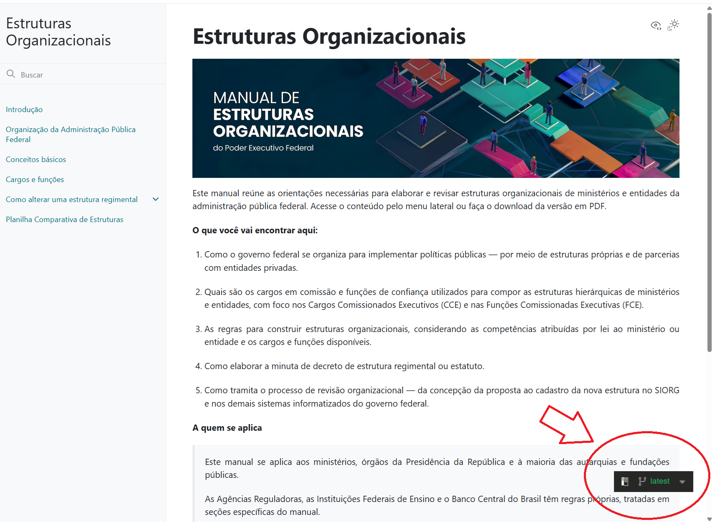
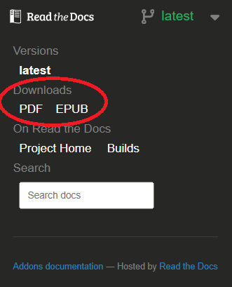

.. _gerar_pdf:

Como gerar o PDF deste manual
==============================

Este manual também está disponível em formato PDF, gerado automaticamente a
partir da mesma versão publicada aqui no site. Você não precisa instalar nada
para obtê-lo — basta seguir os passos abaixo.

Passo a passo
-------------

1. Localize o menu de versões no canto inferior direito da página. 

.. _latest:

   Menu de versões "latest".

2. Clique nesse menu para abrir o painel de opções.

3. Procure a seção **Downloads**.

4. Clique em **PDF** para baixar o manual completo em um único arquivo.
   
.. _pdf_manual:

   Opção para download do manual em pdf

.. note::

   O arquivo PDF é gerado automaticamente pelo site sempre que uma nova versão do manual é publicada. Por isso, o conteúdo do PDF pode levar alguns minutos para refletir as alterações mais recentes feitas no site.

